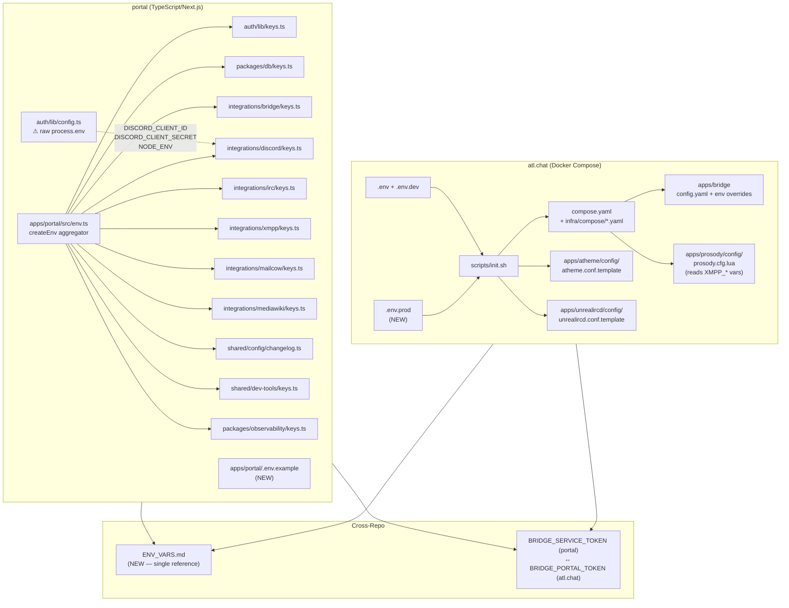
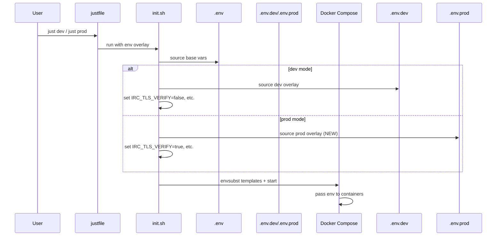
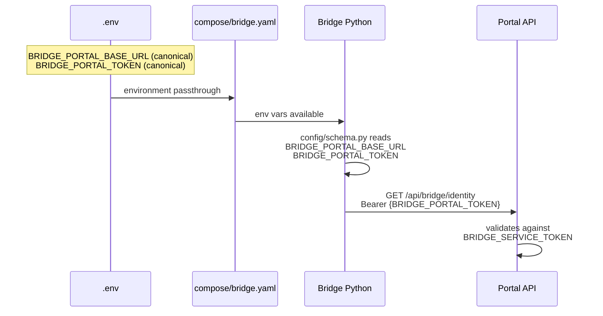
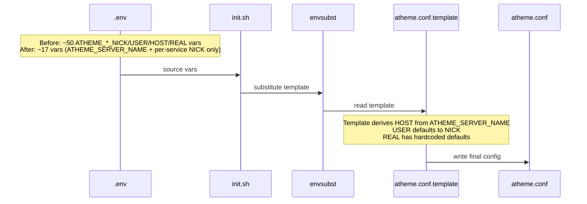

# Design Document: Environment Variable Standardization

## Overview

This feature audits and standardizes environment variable management across two workspaces — `portal` (TypeScript/Next.js monorepo) and `atl.chat` (Docker Compose + shell/Python/Lua infrastructure). The goal is to eliminate raw `process.env` access in portal, remove deprecated aliases in the bridge, simplify Atheme's ~50 service identity vars down to ~17 derivable ones, reduce Prosody's ~55 `Lua.os.getenv` calls to ~15 essential ones by hardcoding sensible defaults, collapse all `PROSODY_` env var prefixes to `XMPP_` (Prosody is an implementation detail — users shouldn't need to know the server software), replace the `ATL_ENVIRONMENT` mode variable with explicit 12-factor vars, create `.env.example` files, and produce a single `ENV_VARS.md` reference document.

The work is organized into seven migration phases (0–6), each independently deployable, progressing from infrastructure (dev/prod split) through naming consolidation, service-level cleanup, to documentation and validation.

## Architecture



## Sequence Diagrams

### Phase 0: Dev vs Prod (12-Factor) Flow



### Phase 1: Bridge Alias Removal Flow



### Phase 2: Atheme Template Simplification



## Components and Interfaces

### Component 1: Portal t3-env Keys System

**Purpose**: Centralized, validated environment variable access for the portal Next.js app via `@t3-oss/env-nextjs`.

**Current Interface** (env.ts aggregator):
```typescript
// apps/portal/src/env.ts — extends all module keys
import { createEnv } from "@t3-oss/env-nextjs";
export const env = createEnv({
  extends: [
    auth(), bridge(), changelog(), database(), devTools(),
    observability(), xmpp(), irc(), mailcow(), discord(), mediawiki(),
  ],
  server: {},
  client: {},
  runtimeEnv: {},
});
```

**Responsibilities**:
- Aggregate all module-level `keys()` functions into a single validated env object
- Ensure no raw `process.env` access outside of `keys.ts` files and `runtimeEnv` mappings
- Provide type-safe access to all environment variables

**Changes Required**:
- Add `DISCORD_CLIENT_ID` and `DISCORD_CLIENT_SECRET` to `discord/keys.ts` (currently accessed raw in `auth/lib/config.ts`)
- Audit `mediawiki/keys.ts` helper functions (`isWikiApiConfigured`, `isMediaWikiConfigured`) that use raw `process.env` — acceptable for boolean checks but should be documented
- Create `apps/portal/.env.example` from the union of all keys modules

### Component 2: atl.chat Environment Loading (init.sh + justfile)

**Purpose**: Load and layer environment variables for Docker Compose services.

**Current Interface**:
```bash
# justfile
dev:
    @set -a && . ./.env.dev && set +a && ./scripts/init.sh
    docker compose --env-file .env --env-file .env.dev --profile dev up -d

prod:
    export ATL_ENVIRONMENT=prod && ./scripts/init.sh
    docker compose --env-file .env up -d
```

**Changes Required**:
- Remove `ATL_ENVIRONMENT` variable entirely
- Add `.env.prod` overlay file (parallel to `.env.dev`)
- Update `just prod` to: `docker compose --env-file .env --env-file .env.prod up -d`
- Add `.env.prod.example`
- Create `compose.dev-override.yaml` and `compose.prod-override.yaml` if needed

### Component 3: Bridge Config Schema (Python)

**Purpose**: Load bridge configuration from `config.yaml` + env var overrides.

**Current Interface**:
```python
# bridge/config/schema.py
_ENV_OVERRIDE_KEYS = (
    "BRIDGE_IRC_REDACT_ENABLED",
    "BRIDGE_RELAYMSG_CLEAN_NICKS",
    "BRIDGE_IRC_TLS_VERIFY",
    "ATL_ENVIRONMENT",  # to be removed
)
```

**Changes Required**:
- Remove `ATL_ENVIRONMENT` from `_ENV_OVERRIDE_KEYS`
- Ensure `BRIDGE_IRC_TLS_VERIFY` is the sole control for TLS verification behavior
- Remove any deprecated alias handling (`BRIDGE_PORTAL_URL` → `BRIDGE_PORTAL_BASE_URL`, `BRIDGE_PORTAL_API_TOKEN` → `BRIDGE_PORTAL_TOKEN`)

### Component 4: Atheme Config Template

**Purpose**: Generate `atheme.conf` from `.env` vars via `envsubst`.

**Current State**: ~50 service identity vars (NICK, USER, HOST, REAL for each service bot).

**Simplification Strategy**: Derive `HOST` from `ATHEME_SERVER_NAME`, default `USER` to `NICK`, hardcode `REAL` descriptions. Reduce to ~17 required vars:

| Keep (required) | Derive/Hardcode |
|---|---|
| `ATHEME_SERVER_NAME` | `*_HOST` → `${ATHEME_SERVER_NAME}` |
| `ATHEME_NICKSERV_NICK` | `*_USER` → defaults to `*_NICK` |
| `ATHEME_CHANSERV_NICK` | `*_REAL` → hardcoded descriptions |
| `ATHEME_OPERSERV_NICK` | |
| `ATHEME_SASLSERV_NICK` | |
| `ATHEME_GROUPSERV_NICK` | |
| `ATHEME_HOSTSERV_NICK` | |
| `ATHEME_HELPSERV_NICK` | |
| `ATHEME_GLOBAL_NICK` | |
| `ATHEME_ALIS_NICK` | |
| + network/admin vars | |

### Component 5: Prosody Config (Lua)

**Purpose**: Configure Prosody XMPP server via `os.getenv()` calls in `prosody.cfg.lua`.

**Current State**: ~55 `os.getenv()` calls using `PROSODY_*` prefix. Many have sensible defaults that never change.

**Simplification Strategy**: 
1. Rename all `PROSODY_*` env vars to `XMPP_*` — Prosody is an implementation detail; the prefix should reflect the protocol.
2. Hardcode defaults for tuning/rate-limit/archive vars. Keep only vars that genuinely differ between deployments (~15):

| Keep (env-configurable) | Hardcode |
|---|---|
| `XMPP_DOMAIN` | `XMPP_ARCHIVE_*` (6 vars) |
| `XMPP_ADMIN_JID` | `XMPP_PUSH_*` (5 vars) |
| `XMPP_SSL_KEY` / `XMPP_SSL_CERT` | `XMPP_C2S_RATE/BURST/STANZA_SIZE` |
| `XMPP_STORAGE` | `XMPP_S2S_RATE/BURST/STANZA_SIZE` |
| `XMPP_DB_*` (5 vars, SQL mode) | `XMPP_HTTP_UPLOAD_RATE/BURST` |
| `XMPP_OAUTH2_REGISTRATION_KEY` | `LUA_GC_*` (4 vars) |
| `XMPP_LOG_LEVEL` | `XMPP_STATISTICS*` (2 vars) |
| `XMPP_ALLOW_REGISTRATION` | `XMPP_BLOCK_REGISTRATIONS_REQUIRE` |
| `XMPP_HTTP_EXTERNAL_URL` | `XMPP_MAX_CONNECTIONS_PER_IP` |
| `XMPP_HTTPS_VIA_PROXY` | `XMPP_REGISTRATION_THROTTLE_*` |
| `XMPP_UPLOAD_EXTERNAL_URL` | |
| `XMPP_PROXY_ADDRESS` | |
| `XMPP_OPENMETRICS_IP/CIDR` | |
| `TURN_SECRET` / `TURN_EXTERNAL_HOST` / `TURN_PORT` / `TURNS_PORT` | |
| TLS policy booleans (4 vars) | |


## Data Models

### Naming Convention Standard

All environment variables across both repos must follow this naming convention:

```
PREFIX_COMPONENT_PURPOSE[_SUFFIX]
```

**Prefixes** (by service):
- `IRC_` — UnrealIRCd / Atheme / IRC network
- `XMPP_` — All XMPP-related config (domain, REST API, storage, TLS, admin). Prosody is the implementation but the prefix is protocol-level. No `PROSODY_` prefix.
- `BRIDGE_` — Discord↔IRC↔XMPP bridge
- `ATHEME_` — Atheme IRC services
- `MAILCOW_` — Mailcow email
- `WIKI_` — MediaWiki
- `NEXT_PUBLIC_` — Client-exposed Next.js vars

**Suffixes** (for sensitive values):
- `_TOKEN` — Bearer/API tokens
- `_SECRET` — Shared secrets
- `_KEY` — API keys or encryption keys
- `_PASSWORD` — Passwords

**Validation Rules**:
- All vars UPPERCASE with underscores
- No trailing underscores
- Tokens/secrets/keys/passwords must use appropriate suffix
- Boolean vars use `true`/`false` (not `1`/`0` except where legacy requires it)

### Cross-Repo Token Mapping

```
Portal                          atl.chat
──────────────────────────────  ──────────────────────────────
BRIDGE_SERVICE_TOKEN       ↔    BRIDGE_PORTAL_TOKEN
  (portal validates)              (bridge sends as Bearer)

IRC_ATHEME_JSONRPC_URL     ↔    (Atheme HTTPD on :8081)
IRC_UNREAL_JSONRPC_URL     ↔    (UnrealIRCd RPC on :8600)
IRC_UNREAL_RPC_USER        ↔    WEBPANEL_RPC_USER
IRC_UNREAL_RPC_PASSWORD    ↔    WEBPANEL_RPC_PASSWORD
XMPP_REST_URL              ↔    (Prosody HTTP on :5280)
XMPP_REST_TOKEN            ↔    (mod_tokenauth Bearer token)
XMPP_DOMAIN                ↔    XMPP_DOMAIN
```

### 12-Factor Explicit Vars (Replacing ATL_ENVIRONMENT)

| Old (mode-based) | New (explicit) | Dev Default | Prod Default |
|---|---|---|---|
| `ATL_ENVIRONMENT=dev` → TLS off | `IRC_TLS_VERIFY=false` | `false` | `true` |
| `ATL_ENVIRONMENT=dev` → Lounge insecure | `IRC_LOUNGE_REJECT_UNAUTHORIZED=false` | `false` | `true` |
| `ATL_ENVIRONMENT=dev` → WS plain | `IRC_WEBSOCKET_USE_TLS=false` | `false` | `true` |
| `ATL_ENVIRONMENT=dev` → Bridge TLS off | `BRIDGE_IRC_TLS_VERIFY=false` | `false` | `true` |

## Algorithmic Pseudocode

### Algorithm: Portal .env.example Generation

```typescript
// Collect all keys from every keys() module in the portal workspace
function generateEnvExample(): string {
  const modules = [
    { name: "Auth", keys: ["BETTER_AUTH_SECRET", "BETTER_AUTH_URL"] },
    { name: "Database", keys: ["DATABASE_URL"] },
    { name: "Discord", keys: [
      "DISCORD_BOT_TOKEN", "NEXT_PUBLIC_DISCORD_GUILD_ID",
      "DISCORD_CLIENT_ID", "DISCORD_CLIENT_SECRET"  // NEW: moved from raw process.env
    ]},
    { name: "Bridge", keys: ["BRIDGE_SERVICE_TOKEN"] },
    { name: "IRC", keys: [
      "IRC_SERVER", "IRC_PORT", "IRC_ATHEME_JSONRPC_URL",
      "IRC_ATHEME_INSECURE_SKIP_VERIFY", "IRC_ATHEME_OPER_ACCOUNT",
      "IRC_ATHEME_OPER_PASSWORD", "IRC_UNREAL_JSONRPC_URL",
      "IRC_UNREAL_RPC_USER", "IRC_UNREAL_RPC_PASSWORD",
      "IRC_UNREAL_INSECURE_SKIP_VERIFY"
    ]},
    { name: "XMPP", keys: ["XMPP_DOMAIN", "XMPP_REST_URL", "XMPP_REST_TOKEN"] },
    { name: "Mailcow", keys: [
      "MAILCOW_API_URL", "MAILCOW_API_KEY", "MAILCOW_DOMAIN",
      "MAILCOW_OAUTH_CLIENT_ID", "MAILCOW_OAUTH_CLIENT_SECRET",
      "NEXT_PUBLIC_MAILCOW_WEB_URL", "NEXT_PUBLIC_MAILCOW_OAUTH_ENABLED"
    ]},
    { name: "MediaWiki", keys: ["WIKI_API_URL", "WIKI_BOT_USERNAME", "WIKI_BOT_PASSWORD"] },
    { name: "Changelog", keys: ["GITHUB_TOKEN"] },
    { name: "Observability", keys: ["SENTRY_DSN", /* etc */] },
    { name: "Dev Tools", keys: ["NEXT_PUBLIC_DEV_TOOLS_ENABLED"] },
  ];

  // Output grouped by module with comments
  return modules.map(m =>
    `# ${m.name}\n` + m.keys.map(k => `${k}=`).join("\n")
  ).join("\n\n");
}
```

**Preconditions:**
- All keys modules exist and export a `keys()` function
- Each keys module declares its vars in the `server` or `client` section

**Postconditions:**
- `.env.example` contains every var from every keys module
- Grouped by module with section comments
- No default values leaked (all set to empty)

### Algorithm: Atheme Template Simplification

```bash
# In atheme.conf.template, replace per-service HOST/USER/REAL with derivations
# Before (per service, repeated ~10 times):
#   ${ATHEME_NICKSERV_NICK}
#   ${ATHEME_NICKSERV_USER}
#   ${ATHEME_NICKSERV_HOST}
#   ${ATHEME_NICKSERV_REAL}

# After (template uses shell defaults via envsubst-compatible syntax):
# Since envsubst doesn't support ${VAR:-default}, the template itself
# hardcodes the derived values using only the NICK + SERVER_NAME vars.

# Template pattern for each service block:
#   nick = "${ATHEME_NICKSERV_NICK}";
#   user = "${ATHEME_NICKSERV_NICK}";          /* USER defaults to NICK */
#   host = "${ATHEME_SERVER_NAME}";             /* HOST always = server name */
#   real = "Nickname Services";                 /* REAL is static description */
```

**Preconditions:**
- `ATHEME_SERVER_NAME` is set in `.env`
- Each service has at minimum a `*_NICK` var defined

**Postconditions:**
- Template only references `ATHEME_SERVER_NAME` + `ATHEME_*_NICK` vars
- `HOST` fields all resolve to `ATHEME_SERVER_NAME`
- `USER` fields default to the service's `NICK` value
- `REAL` fields are hardcoded descriptive strings
- Reduces ~50 vars to ~17

### Algorithm: Prosody Env Var Reduction

```lua
-- Before: every tuning param is a os.getenv() call with PROSODY_ prefix
-- limits.c2s.rate = os.getenv("PROSODY_C2S_RATE") or "10kb/s"

-- After: hardcode defaults, rename remaining to XMPP_*, only getenv for deployment-specific vars
limits = {
    c2s = {
        rate = "10kb/s",      -- hardcoded (was PROSODY_C2S_RATE)
        burst = "25kb",       -- hardcoded (was PROSODY_C2S_BURST)
        stanza_size = 262144, -- hardcoded (was PROSODY_C2S_STANZA_SIZE)
    },
    s2s = {
        rate = "30kb/s",      -- hardcoded
        burst = "100kb",      -- hardcoded
        stanza_size = 524288, -- hardcoded
    },
    http_upload = {
        rate = "2mb/s",       -- hardcoded
        burst = "10mb",       -- hardcoded
    },
}

-- Keep only genuinely variable settings as getenv:
local domain = os.getenv("XMPP_DOMAIN") or "atl.chat"
local log_level = os.getenv("XMPP_LOG_LEVEL") or "info"
```

**Preconditions:**
- Current defaults in `.env.example` match the hardcoded values
- No deployment has customized the tuning vars away from defaults

**Postconditions:**
- `Lua.os.getenv()` calls reduced from ~55 to ~15
- All remaining getenv calls use `XMPP_` prefix (no `PROSODY_` prefix)
- All hardcoded values match previous `.env.example` defaults
- Deployment-specific vars (domain, TLS, storage, auth) remain configurable

### Algorithm: ATL_ENVIRONMENT Removal

```bash
# Phase 0: Replace ATL_ENVIRONMENT with explicit 12-factor vars

# .env.dev (overlay for dev):
IRC_TLS_VERIFY=false
IRC_LOUNGE_REJECT_UNAUTHORIZED=false
IRC_WEBSOCKET_USE_TLS=false
BRIDGE_IRC_TLS_VERIFY=false

# .env.prod (NEW overlay for prod):
IRC_TLS_VERIFY=true
IRC_LOUNGE_REJECT_UNAUTHORIZED=true
IRC_WEBSOCKET_USE_TLS=true
BRIDGE_IRC_TLS_VERIFY=true

# Bridge config/schema.py: remove ATL_ENVIRONMENT from _ENV_OVERRIDE_KEYS
# init.sh: remove ATL_ENVIRONMENT references
# justfile prod: use --env-file .env --env-file .env.prod
```

**Preconditions:**
- `ATL_ENVIRONMENT` is currently used in: bridge `_ENV_OVERRIDE_KEYS`, init.sh, justfile, `.env.example`
- All behavior gated on `ATL_ENVIRONMENT` can be expressed as explicit boolean vars

**Postconditions:**
- `ATL_ENVIRONMENT` removed from all files
- Each behavior has its own explicit env var
- `just dev` loads `.env` + `.env.dev`; `just prod` loads `.env` + `.env.prod`

## Key Functions with Formal Specifications

### Function 1: Discord OAuth Keys Migration (Portal)

```typescript
// integrations/discord/keys.ts — UPDATED
export const keys = () =>
  createEnv({
    server: {
      DISCORD_BOT_TOKEN: z.string().min(1).optional(),
      DISCORD_CLIENT_ID: z.string().min(1).optional(),      // NEW
      DISCORD_CLIENT_SECRET: z.string().min(1).optional(),   // NEW
    },
    client: {
      NEXT_PUBLIC_DISCORD_GUILD_ID: z.string().min(1).optional(),
    },
    runtimeEnv: {
      DISCORD_BOT_TOKEN: process.env.DISCORD_BOT_TOKEN,
      NEXT_PUBLIC_DISCORD_GUILD_ID: process.env.NEXT_PUBLIC_DISCORD_GUILD_ID,
      DISCORD_CLIENT_ID: process.env.DISCORD_CLIENT_ID,         // NEW
      DISCORD_CLIENT_SECRET: process.env.DISCORD_CLIENT_SECRET, // NEW
    },
  });
```

**Preconditions:**
- `DISCORD_CLIENT_ID` and `DISCORD_CLIENT_SECRET` are currently accessed as raw `process.env` in `auth/lib/config.ts`

**Postconditions:**
- Both vars are registered in the discord keys module with Zod validation
- `auth/lib/config.ts` imports from `discord/keys.ts` instead of raw `process.env`
- The `env.ts` aggregator already includes `discord()`, so no change needed there

### Function 2: Auth Config Update (Portal)

```typescript
// auth/lib/config.ts — UPDATED socialProviders section
import { keys as discordKeys } from "@/features/integrations/lib/discord/keys";

const discordEnv = discordKeys();

const socialProviders = {
  discord: {
    clientId: discordEnv.DISCORD_CLIENT_ID ?? "",
    clientSecret: discordEnv.DISCORD_CLIENT_SECRET ?? "",
  },
};
```

**Preconditions:**
- `auth/lib/config.ts` currently uses `process.env.DISCORD_CLIENT_ID as string`
- Discord keys module exports `DISCORD_CLIENT_ID` and `DISCORD_CLIENT_SECRET`

**Postconditions:**
- No raw `process.env` access in `auth/lib/config.ts` for Discord vars
- `NODE_ENV` access via `process.env.NODE_ENV` is acceptable (Next.js built-in, not a custom var)

### Function 3: Bridge Env Override Cleanup (Python)

```python
# bridge/config/schema.py — UPDATED
_ENV_OVERRIDE_KEYS = (
    "BRIDGE_IRC_REDACT_ENABLED",
    "BRIDGE_RELAYMSG_CLEAN_NICKS",
    "BRIDGE_IRC_TLS_VERIFY",
    # ATL_ENVIRONMENT removed — replaced by explicit BRIDGE_IRC_TLS_VERIFY
)
```

**Preconditions:**
- `ATL_ENVIRONMENT` is in `_ENV_OVERRIDE_KEYS` and used to derive TLS behavior
- `BRIDGE_IRC_TLS_VERIFY` already exists as an explicit override

**Postconditions:**
- `ATL_ENVIRONMENT` removed from override keys
- TLS behavior controlled solely by `BRIDGE_IRC_TLS_VERIFY`

## Example Usage

### Portal: Accessing Discord OAuth vars (after migration)

```typescript
// Before (auth/lib/config.ts):
const socialProviders = {
  discord: {
    clientId: process.env.DISCORD_CLIENT_ID as string,    // ❌ raw access
    clientSecret: process.env.DISCORD_CLIENT_SECRET as string, // ❌ raw access
  },
};

// After (auth/lib/config.ts):
import { keys as discordKeys } from "@/features/integrations/lib/discord/keys";
const discordEnv = discordKeys();
const socialProviders = {
  discord: {
    clientId: discordEnv.DISCORD_CLIENT_ID ?? "",    // ✅ validated via t3-env
    clientSecret: discordEnv.DISCORD_CLIENT_SECRET ?? "", // ✅ validated via t3-env
  },
};
```

### atl.chat: Dev vs Prod startup (after 12-factor migration)

```bash
# Before:
just prod  # sets ATL_ENVIRONMENT=prod, init.sh branches on it

# After:
just prod  # loads .env + .env.prod (explicit vars)
# .env.prod contains:
#   IRC_TLS_VERIFY=true
#   BRIDGE_IRC_TLS_VERIFY=true
#   IRC_LOUNGE_REJECT_UNAUTHORIZED=true
#   IRC_WEBSOCKET_USE_TLS=true
```

### Atheme template (after simplification)

```
# Before (.env): 4 vars per service × 10 services = 40 vars
ATHEME_NICKSERV_NICK=NickServ
ATHEME_NICKSERV_USER=NickServ
ATHEME_NICKSERV_HOST=services.atl.chat
ATHEME_NICKSERV_REAL="Nickname Services"

# After (.env): 1 var per service + 1 shared = 11 vars
ATHEME_SERVER_NAME=services.atl.chat
ATHEME_NICKSERV_NICK=NickServ
# USER, HOST, REAL derived in template
```


## Correctness Properties

1. **No raw process.env in portal app code**: For all TypeScript files in `apps/portal/src/` (excluding `keys.ts` files and `runtimeEnv` blocks), `process.env` must not appear. Exception: `process.env.NODE_ENV` (Next.js built-in).

2. **All portal env vars registered in keys modules**: For every environment variable used by the portal app, there exists a `keys.ts` module that declares it in a `createEnv` call, and that module is included in `env.ts` `extends` array.

3. **No ATL_ENVIRONMENT references**: After Phase 0, `ATL_ENVIRONMENT` must not appear in any non-example, non-documentation file across both repos.

4. **Atheme template var reduction**: The `atheme.conf.template` must reference at most 17 unique `${ATHEME_*}` variable substitutions (down from ~50).

5. **Prosody getenv reduction**: `prosody.cfg.lua` must contain at most 20 `os.getenv()` calls (down from ~55), and all remaining calls must use `XMPP_` prefix (no `PROSODY_` prefix).

6. **No PROSODY_ prefix in user-facing config**: After migration, `PROSODY_` must not appear in any `.env.example`, `.env.dev.example`, `.env.prod.example`, compose `environment:` blocks, or documentation. The `prosody.cfg.lua` file itself reads `XMPP_*` vars via `os.getenv()`.

6. **Cross-repo token consistency**: `BRIDGE_SERVICE_TOKEN` in portal's `bridge/keys.ts` and `BRIDGE_PORTAL_TOKEN` in atl.chat's `.env.example` must be documented as the same shared secret in `ENV_VARS.md`.

7. **.env.example completeness**: `apps/portal/.env.example` must contain every variable declared across all `keys.ts` modules. `atl.chat/.env.example` must contain every variable referenced in compose files, templates, and scripts.

8. **12-factor explicit vars**: Each behavior previously gated on `ATL_ENVIRONMENT` must have its own explicit boolean env var with a clear name indicating what it controls.

## Error Handling

### Error Scenario 1: Missing Required Env Var at Runtime

**Condition**: A required env var (e.g., `XMPP_DOMAIN`) is not set when the service starts.
**Response**: t3-env throws a validation error at import time (portal); Prosody entrypoint exits with error message (atl.chat).
**Recovery**: User checks `.env.example`, adds missing var to `.env`.

### Error Scenario 2: Deprecated Alias Still in Use

**Condition**: User's `.env` still contains `BRIDGE_PORTAL_URL` (deprecated) instead of `BRIDGE_PORTAL_BASE_URL`.
**Response**: Bridge ignores the old name; Portal API calls fail with connection errors.
**Recovery**: Migration guide in `ENV_VARS.md` documents the rename. `.env.example` only shows canonical names.

### Error Scenario 3: ATL_ENVIRONMENT Still Set After Migration

**Condition**: User hasn't updated their `.env` and still has `ATL_ENVIRONMENT=dev`.
**Response**: Variable is ignored (no code reads it). No behavioral impact.
**Recovery**: `.env.example` no longer includes it; user removes on next `.env` refresh.

## Testing Strategy

### Unit Testing Approach

- **Portal keys modules**: Each `keys.ts` module tested with valid/invalid env var combinations to verify Zod validation
- **Bridge config schema**: Test `_load_env_overrides()` with and without `ATL_ENVIRONMENT` to verify it's no longer read
- **Atheme template**: Run `envsubst` on simplified template with minimal vars, verify output matches expected config

### Property-Based Testing Approach

**Property Test Library**: fast-check (portal), hypothesis (bridge)

- **Portal env completeness**: For any subset of keys modules, the union of their declared vars equals the vars in `.env.example`
- **Atheme derivation correctness**: For any `ATHEME_SERVER_NAME` value, all `HOST` fields in generated config equal that value
- **Naming convention compliance**: For any env var name in `.env.example`, it matches the regex `^[A-Z][A-Z0-9_]*[A-Z0-9]$` and sensitive vars end with `_TOKEN|_SECRET|_KEY|_PASSWORD`

### Integration Testing Approach

- **Portal build**: `pnpm build` succeeds with only `.env.example` vars set (all optional vars can be empty)
- **atl.chat init**: `./scripts/init.sh` completes without errors using `.env.example` + `.env.dev.example`
- **Bridge startup**: Bridge container starts and logs "Portal client disabled" when `BRIDGE_PORTAL_BASE_URL` is empty (no crash)

## Security Considerations

- **No secrets in .env.example**: All example files use `change_me_*` placeholders, never real values
- **Token suffix convention**: All sensitive vars must end with `_TOKEN`, `_SECRET`, `_KEY`, or `_PASSWORD` to enable automated secret scanning (gitleaks patterns)
- **Minimal env exposure**: Docker Compose `environment:` blocks should only list vars the container actually needs (principle of least privilege)
- **No secrets in templates**: `envsubst` templates must not contain hardcoded secrets; all secrets come from env vars

## Performance Considerations

- **Prosody startup**: Reducing `Lua.os.getenv()` calls from ~55 to ~15 has negligible performance impact (microseconds) but significantly improves config readability and maintainability
- **Portal build time**: No impact — t3-env validation happens at runtime, not build time
- **Template generation**: `envsubst` with fewer vars is marginally faster but the difference is immaterial

## Dependencies

- `@t3-oss/env-nextjs` — Portal env validation (already installed)
- `zod` — Schema validation for env vars (already installed)
- `envsubst` (gettext-base) — Template substitution for atl.chat configs (already installed)
- `fast-check` — Property-based testing for portal (dev dependency)
- `hypothesis` — Property-based testing for bridge (dev dependency)

## Migration Phases

### Phase 0: Dev vs Prod (12-Factor)
Remove `ATL_ENVIRONMENT`. Create `.env.prod` + `.env.prod.example`. Update justfile, init.sh, bridge config schema. Add explicit boolean vars.

### Phase 1: PROSODY_ → XMPP_ Prefix Collapse
Rename all `PROSODY_*` env vars to `XMPP_*` across both repos. Update `prosody.cfg.lua` getenv calls, compose `environment:` blocks, `.env.example`, `.env.dev.example`, entrypoint scripts, portal `xmpp/keys.ts`, and all documentation. Prosody is an implementation detail — the prefix should be protocol-level.

### Phase 2: Bridge Alias Removal
Remove deprecated `BRIDGE_PORTAL_URL` and `BRIDGE_PORTAL_API_TOKEN` aliases from bridge code and documentation. Canonical names only.

### Phase 3: Atheme Template Simplification
Rewrite `atheme.conf.template` to derive HOST/USER/REAL from `ATHEME_SERVER_NAME` + `*_NICK`. Update `.env.example`.

### Phase 4: Documentation
Create `ENV_VARS.md` as single cross-repo reference. Update `AGENTS.md` files in both repos.

### Phase 5: Portal .env.example + Discord Keys
Add `DISCORD_CLIENT_ID`/`DISCORD_CLIENT_SECRET` to discord keys module. Update `auth/lib/config.ts`. Create `apps/portal/.env.example`.

### Phase 6: Validation
Verify no raw `process.env` in portal (except keys.ts). Verify `ATL_ENVIRONMENT` removed. Verify no `PROSODY_` prefix in user-facing config. Verify Atheme/Prosody var counts. Run builds and tests.
