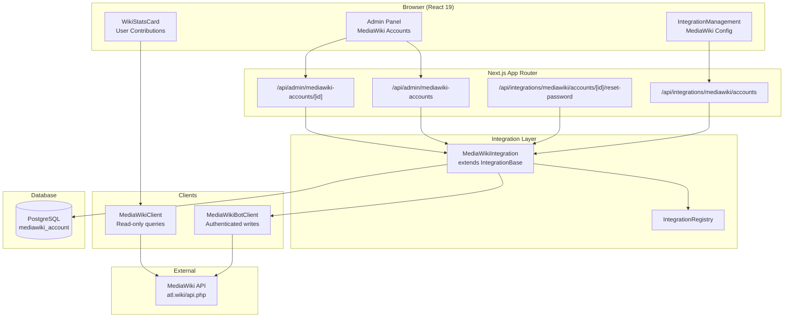

# Design Document: MediaWiki Integration

## Overview

This design adds full MediaWiki integration to the ATL Portal, extending the existing read-only MediaWiki client with an authenticated bot client for write operations and a complete integration lifecycle (database schema, API routes, UI components, admin management, user stats).

The integration follows the established patterns from IRC and XMPP integrations: a Drizzle schema in `@portal/db`, Zod validation schemas in `@portal/schemas`, an `IntegrationBase` subclass registered in the `IntegrationRegistry`, Next.js App Router API routes, and `IntegrationManagement` UI components.

Key design decisions:
- The new `MediaWikiBotClient` is a separate class from the existing read-only `MediaWikiClient`. The read-only client continues to serve unauthenticated GET queries (site stats, recent changes, page info). The bot client handles authenticated write operations (account creation, blocking, password reset) using session cookies.
- Session cookie management uses a `Map<string, string>` parsed from `set-cookie` headers, passed back on subsequent requests. The bot client authenticates lazily on first write and re-authenticates once on token rejection.
- Account creation follows MediaWiki's two-step flow: fetch a `createaccount` token, then POST `action=createaccount`. A temporary password is generated server-side and returned once to the user.
- Password reset calls `action=resetpassword`, which sends an email to the wiki account's configured email address. The portal does not receive or generate a new password.
- Deletion soft-deletes the local record (status → `deleted`) and attempts to block the MediaWiki account. Block failure is non-fatal, matching the IRC pattern where external service failures don't prevent local cleanup.

## Architecture



The architecture separates concerns into layers:
1. **UI Layer**: React components using TanStack Query hooks to call API routes
2. **API Layer**: Next.js route handlers that authenticate requests, validate input with Zod, and delegate to the integration implementation
3. **Integration Layer**: `MediaWikiIntegration` class extending `IntegrationBase`, registered in the `IntegrationRegistry`, orchestrating database operations and bot client calls
4. **Client Layer**: Two clients — the existing read-only `MediaWikiClient` for GET queries and the new `MediaWikiBotClient` for authenticated writes
5. **Data Layer**: Drizzle ORM schema for `mediawiki_account` in PostgreSQL

## Components and Interfaces

### 1. Database Schema (`packages/db/src/schema/mediawiki.ts`)

New Drizzle table `mediawiki_account` following the IRC/XMPP pattern:
- `pgEnum` for status: `active`, `suspended`, `deleted`
- `pgTable` with `id`, `userId`, `wikiUsername`, `wikiUserId`, `status`, `createdAt`, `updatedAt`, `metadata`
- Unique indexes on `userId` and `wikiUsername` filtered to non-deleted records
- Cascade delete on `userId` foreign key to `user.id`
- `createSelectSchema` and `createInsertSchema` for Zod generation

### 2. Zod Validation Schemas (`packages/schemas/src/integrations/mediawiki.ts`)

Following the IRC/XMPP pattern:
- `MediaWikiAccountStatusSchema` — enum: `active`, `suspended`, `deleted`
- `WikiUsernameSchema` — branded string, 1–85 chars, alphanumeric + spaces/hyphens/underscores
- `CreateMediaWikiAccountRequestSchema` — `{ wikiUsername: WikiUsernameSchema }`
- `UpdateMediaWikiAccountRequestSchema` — partial create + `status` + `metadata`
- `MediaWikiAccountSchema` — extends `selectMediawikiAccountSchema` with `integrationId: "mediawiki"` and `metadata` typing

### 3. Environment Configuration (`apps/portal/src/features/integrations/lib/mediawiki/keys.ts`)

Extend existing `keys()` to add:
- `WIKI_BOT_USERNAME` — optional string, bot account name from Special:BotPasswords
- `WIKI_BOT_PASSWORD` — optional string, bot password

`WIKI_API_URL` keeps its existing default of `https://atl.wiki/api.php`.

### 4. MediaWiki Bot Client (`apps/portal/src/features/integrations/lib/mediawiki/bot-client.ts`)

New authenticated client class:

```typescript
class MediaWikiBotClient {
  private cookies: Map<string, string> = new Map();
  private authenticated = false;

  /** Login via action=login with bot credentials. Stores session cookies. */
  async login(): Promise<void>;

  /** Fetch a token of the given type (csrf, createaccount, login). */
  async getToken(type: "csrf" | "createaccount" | "login"): Promise<string>;

  /** Create a wiki account. Returns { username, userId }. */
  async createAccount(username: string, password: string): Promise<{ username: string; userId: number }>;

  /** Reset password (sends email). */
  async resetPassword(username: string): Promise<void>;

  /** Block a user. */
  async blockUser(username: string, reason: string, options?: { expiry?: string; nocreate?: boolean; autoblock?: boolean }): Promise<void>;

  /** Unblock a user. */
  async unblockUser(username: string, reason: string): Promise<void>;

  /** Get user info (edit count, registration, groups, block status). */
  async getUserInfo(username: string): Promise<UserInfo>;

  /** Get recent contributions for a user. */
  async getUserContribs(username: string, limit?: number): Promise<UserContrib[]>;
}
```

Key behaviors:
- `login()` performs the two-step MediaWiki login: fetch login token, then POST `action=login` with `lgname`, `lgpassword`, `lgtoken`. Stores all `set-cookie` values.
- All write methods call `ensureAuthenticated()` which calls `login()` if not yet authenticated.
- On token rejection (e.g. `badtoken` error), re-authenticates once and retries.
- `getUserInfo()` and `getUserContribs()` use the authenticated session but are read operations — they could also work unauthenticated, but using the bot session simplifies the implementation and avoids rate limits.

### 5. MediaWiki Integration Implementation (`apps/portal/src/features/integrations/lib/mediawiki/implementation.ts`)

```typescript
class MediaWikiIntegration extends IntegrationBase<
  MediaWikiAccount & { temporaryPassword?: string },
  CreateMediaWikiAccountRequest,
  UpdateMediaWikiAccountRequest
> {
  constructor(); // id: "mediawiki", name: "MediaWiki", enabled: isMediaWikiConfigured()

  async createAccount(userId: string, input: CreateMediaWikiAccountRequest): Promise<MediaWikiAccount & { temporaryPassword: string }>;
  async getAccount(userId: string): Promise<MediaWikiAccount | null>;
  async getAccountById(accountId: string): Promise<MediaWikiAccount | null>;
  async updateAccount(accountId: string, input: UpdateMediaWikiAccountRequest): Promise<MediaWikiAccount>;
  async deleteAccount(accountId: string): Promise<void>;
  async resetPassword(accountId: string): Promise<void>;
}
```

`createAccount` flow:
1. Validate input with `CreateMediaWikiAccountRequestSchema`
2. Check no existing active account for this user
3. Check wiki username not taken locally
4. Generate temporary password (crypto.randomUUID-based, 20+ chars)
5. Insert DB record with status `pending`
6. Call `botClient.createAccount(wikiUsername, tempPassword)`
7. On success: update DB to `active`, return account with `temporaryPassword`
8. On failure: delete pending DB record, throw descriptive error

`deleteAccount` flow:
1. Fetch account record
2. Attempt `botClient.blockUser(wikiUsername, reason, { nocreate: true, autoblock: true })`
3. Block failure is logged but non-fatal
4. Update DB status to `deleted`

`resetPassword` flow:
1. Fetch account, verify ownership
2. Call `botClient.resetPassword(wikiUsername)`
3. Return success message about email being sent

### 6. Integration Registration

Add `registerMediaWikiIntegration()` to `lib/mediawiki/index.ts` and call it from `lib/index.ts` alongside IRC, XMPP, and Mailcow.

### 7. API Routes

Following existing patterns:

| Route | Method | Purpose |
|-------|--------|---------|
| `/api/integrations/mediawiki/accounts` | GET | Get current user's wiki account |
| `/api/integrations/mediawiki/accounts` | POST | Create wiki account |
| `/api/integrations/mediawiki/accounts/[id]` | DELETE | Delete wiki account |
| `/api/integrations/mediawiki/accounts/[id]/reset-password` | POST | Trigger password reset email |
| `/api/admin/mediawiki-accounts` | GET | List all wiki accounts (admin) |
| `/api/admin/mediawiki-accounts/[id]` | PATCH | Update wiki account status (admin) |

The integration routes at `/api/integrations/[integration]/accounts` are already handled by the generic integration route handlers. The `reset-password` route follows the existing pattern at `/api/integrations/[integration]/accounts/[id]/reset-password`.

Admin routes follow the IRC admin pattern: paginated list with status filter, PATCH for status updates that trigger block/unblock on MediaWiki.

### 8. UI Components

**Integration Management** — Uses the existing `IntegrationManagement` component with MediaWiki-specific config:
- Setup dialog collects `wikiUsername` via the standard single-input pattern
- On success, displays temporary password in a confirmation dialog with copy-to-clipboard
- Account card shows wiki username, status, creation date
- Actions: password reset (with info about email), disconnect

**Wiki User Stats Card** (`apps/portal/src/features/integrations/components/wiki-user-stats.tsx`):
- Fetches user info and recent contribs via the bot client (through a dedicated API route or server component)
- Displays total edit count, registration date, most recent edit
- Skeleton loading state, error fallback

**Wiki Site Stats** — The existing `fetchWikiStats()` in `shared/wiki/` already handles site-level stats via the read-only client. The dashboard component continues to use this.

**Admin Panel** — Table of wiki accounts with status filter, suspend/reactivate actions following the IRC admin pattern.

### 9. TanStack Query Integration

Uses existing hooks from `use-integration.ts`:
- `useIntegrationAccount<MediaWikiAccount>("mediawiki")` for fetching
- `useCreateIntegrationAccount<MediaWikiAccount>("mediawiki")` for creation
- `useDeleteIntegrationAccount("mediawiki")` for deletion
- `useResetIntegrationPassword("mediawiki")` for password reset

New hook for user wiki stats:
- `useWikiUserStats(wikiUsername)` — fetches edit count, registration, recent contribs

## Data Models

### mediawiki_account Table

| Column | Type | Constraints |
|--------|------|-------------|
| `id` | `text` | PK, default `crypto.randomUUID()` |
| `user_id` | `text` | NOT NULL, FK → `user.id` ON DELETE CASCADE |
| `wiki_username` | `text` | NOT NULL |
| `wiki_user_id` | `integer` | nullable (set after successful creation) |
| `status` | `mediawiki_account_status` | NOT NULL, default `active` |
| `created_at` | `timestamp` | NOT NULL, default `now()` |
| `updated_at` | `timestamp` | NOT NULL, default `now()`, auto-update |
| `metadata` | `jsonb` | nullable |

Indexes:
- `mediawiki_account_status_idx` on `status`
- `mediawiki_account_userId_active_idx` UNIQUE on `user_id` WHERE `status != 'deleted'`
- `mediawiki_account_wikiUsername_active_idx` UNIQUE on `wiki_username` WHERE `status != 'deleted'`

### MediaWiki API Response Types

```typescript
interface UserInfo {
  userId: number;
  name: string;
  editCount: number;
  registration: string; // ISO timestamp
  groups: string[];
  blockExpiry?: string;
}

interface UserContrib {
  title: string;
  timestamp: string;
  comment: string;
  sizeDiff: number;
}
```

### Environment Variables

| Variable | Required | Default | Purpose |
|----------|----------|---------|---------|
| `WIKI_API_URL` | No | `https://atl.wiki/api.php` | MediaWiki API endpoint |
| `WIKI_BOT_USERNAME` | For bot ops | — | Bot account name (Special:BotPasswords) |
| `WIKI_BOT_PASSWORD` | For bot ops | — | Bot account password |


## Correctness Properties

*A property is a characteristic or behavior that should hold true across all valid executions of a system — essentially, a formal statement about what the system should do. Properties serve as the bridge between human-readable specifications and machine-verifiable correctness guarantees.*

### Property 1: Uniqueness constraints for non-deleted accounts

*For any* two non-deleted `mediawiki_account` records, their `wiki_username` values must differ AND their `user_id` values must differ. Equivalently, inserting a second non-deleted record with the same `wiki_username` or `user_id` must be rejected by the database.

**Validates: Requirements 1.2, 1.3**

### Property 2: Session cookies persist across requests

*For any* sequence of bot client requests after a successful login, every request must include the session cookies obtained during login. Specifically, if `login()` succeeds and stores cookies C, then for all subsequent requests R, the cookie header of R must contain C.

**Validates: Requirements 2.2**

### Property 3: Login failure prevents write operations

*For any* bot client instance where `login()` has failed, all subsequent write operations (`createAccount`, `resetPassword`, `blockUser`, `unblockUser`) must return an error without making API calls to MediaWiki.

**Validates: Requirements 2.5**

### Property 4: Successful account creation persists active record with temporary password

*For any* valid wiki username and user ID where no prior non-deleted account exists, if the MediaWiki API returns a success response for `action=createaccount`, then the database must contain a `mediawiki_account` record with status `active` for that user, AND the returned result must include a non-empty `temporaryPassword` string.

**Validates: Requirements 3.3, 3.4**

### Property 5: Failed creation leaves no database record

*For any* account creation attempt where the MediaWiki API returns an error, the database must not contain a `mediawiki_account` record for that user/username combination (any pending record created during the attempt must be cleaned up).

**Validates: Requirements 3.6**

### Property 6: Wiki username validation

*For any* string, the wiki username validator must accept it if and only if it contains only alphanumeric characters, spaces, hyphens, and underscores, and its length is between 1 and 85 characters inclusive. Strings outside this set must be rejected.

**Validates: Requirements 3.7**

### Property 7: Account retrieval round-trip

*For any* successfully created `mediawiki_account`, calling `getAccount(userId)` must return an account object whose `wikiUsername`, `wikiUserId`, `status`, `createdAt`, and `updatedAt` fields match the stored database record. Similarly, calling `getAccountById(accountId)` must return the same data.

**Validates: Requirements 4.1, 4.3**

### Property 8: Ownership authorization for write operations

*For any* user A and any `mediawiki_account` owned by a different user B, attempting to perform a password reset or deletion on that account as user A must be rejected with an authorization error.

**Validates: Requirements 5.5, 6.4**

### Property 9: Deletion resilience — soft-delete regardless of external block result

*For any* `mediawiki_account` deletion, regardless of whether the MediaWiki API `action=block` call succeeds or fails, the local database record must have its status updated to `deleted`.

**Validates: Requirements 6.1, 6.3**

### Property 10: Configuration determines enabled status

*For any* combination of environment variable values, the `MediaWikiIntegration.enabled` flag must be `true` if and only if `WIKI_API_URL`, `WIKI_BOT_USERNAME`, and `WIKI_BOT_PASSWORD` are all set to non-empty values.

**Validates: Requirements 7.4, 7.5, 13.1, 13.4**

### Property 11: Admin status filter returns only matching accounts

*For any* status value S passed as a filter to the admin list endpoint, every returned `mediawiki_account` record must have `status === S`.

**Validates: Requirements 11.2**

### Property 12: Admin suspend/reactivate toggles account status

*For any* active `mediawiki_account`, an admin suspend action must change its status to `suspended`. *For any* suspended `mediawiki_account`, an admin reactivate action must change its status to `active`.

**Validates: Requirements 11.3**

### Property 13: Unauthenticated requests return 401

*For any* request to a protected MediaWiki integration endpoint that does not include valid authentication credentials, the response status code must be 401.

**Validates: Requirements 12.4**

### Property 14: Non-admin requests to admin endpoints return 403

*For any* authenticated request from a non-admin user to an admin MediaWiki account management endpoint, the response status code must be 403.

**Validates: Requirements 12.5**

### Property 15: Invalid request bodies are rejected

*For any* request body that does not conform to the endpoint's Zod schema, the endpoint must return an error response (4xx) without performing the requested operation.

**Validates: Requirements 12.6**

## Error Handling

### Bot Client Errors

| Error Scenario | Handling | User-Facing Message |
|---------------|----------|-------------------|
| Bot login fails (bad credentials) | Log error via Sentry, mark client as unauthenticated, prevent writes | "Wiki integration is temporarily unavailable" |
| Token fetch fails | Re-authenticate once, retry; if still fails, throw | "Failed to perform wiki operation. Please try again." |
| Session expired (badtoken) | Re-authenticate, retry once | Transparent to user (retry is automatic) |
| MediaWiki API unreachable | Catch fetch error, log via Sentry | "Wiki service is unreachable. Please try again later." |

### Account Creation Errors

| Error Scenario | Handling | User-Facing Message |
|---------------|----------|-------------------|
| Username already taken (MediaWiki) | Parse `createaccount` error response | "This wiki username is already taken. Please choose another." |
| Username already taken (local DB) | Check before API call | "This wiki username is already in use." |
| User already has active account | Check before API call | "You already have a wiki account." |
| Invalid username format | Zod validation rejects | Zod error message (e.g., "Username must be 1–85 characters...") |
| API creation fails after DB insert | Delete pending DB record, log via Sentry | "Failed to create wiki account. Please try again." |

### Password Reset Errors

| Error Scenario | Handling | User-Facing Message |
|---------------|----------|-------------------|
| No email on wiki account | Parse MediaWiki error response | "Your wiki account has no email configured. Please set one at atl.wiki first." |
| Account not found | 404 response | "Wiki account not found." |
| User doesn't own account | 403 response | "You don't have permission to reset this account's password." |

### Admin Operation Errors

| Error Scenario | Handling | User-Facing Message |
|---------------|----------|-------------------|
| Block fails on suspend | Log via Sentry, still update local status | "Account suspended locally. Note: MediaWiki block may not have applied." |
| Unblock fails on reactivate | Log via Sentry, still update local status | "Account reactivated locally. Note: MediaWiki unblock may not have applied." |

### General Patterns

- All errors are captured via `Sentry.captureException` with integration-specific tags (`integration: "mediawiki"`, `step: "<operation>"`)
- External API failures (MediaWiki unreachable, bad responses) are non-fatal for local state changes where possible (deletion, status updates)
- All user-facing error messages avoid exposing internal details (API URLs, token values, stack traces)
- Zod validation errors are returned as 400 responses with the first issue message

## Testing Strategy

### Unit Tests

Unit tests verify specific examples, edge cases, and integration points:

- **Username validation**: specific valid/invalid examples (empty string, 86 chars, special characters, Unicode, spaces)
- **Bot client login flow**: mock MediaWiki API responses for success, failure, token rejection + retry
- **Account creation flow**: mock bot client, verify DB state after success/failure
- **Password reset flow**: mock bot client, verify correct API calls and error handling
- **Deletion flow**: mock bot client success/failure, verify DB soft-delete in both cases
- **Admin endpoints**: mock auth middleware, verify 401/403 responses
- **Environment configuration**: verify `isMediaWikiConfigured()` with various env var combinations
- **Row-to-account mapping**: verify `rowToAccount` correctly transforms DB rows

### Property-Based Tests

Property-based tests verify universal properties across randomly generated inputs. Use `fast-check` as the PBT library (already available in the project ecosystem for TypeScript).

Each property test must:
- Run a minimum of 100 iterations
- Reference its design document property via a tag comment
- Use `fast-check` arbitraries to generate random inputs

**Property tests to implement:**

1. **Feature: mediawiki-integration, Property 6: Wiki username validation** — Generate random strings, verify the validator accepts exactly the valid character set and length range.

2. **Feature: mediawiki-integration, Property 1: Uniqueness constraints** — Generate random account data, verify duplicate username/userId insertions are rejected for non-deleted records.

3. **Feature: mediawiki-integration, Property 4: Successful creation round-trip** — Generate random valid usernames, mock successful API response, verify DB record is active and temp password is returned.

4. **Feature: mediawiki-integration, Property 5: Failed creation cleanup** — Generate random valid usernames, mock failed API response, verify no DB record persists.

5. **Feature: mediawiki-integration, Property 7: Account retrieval round-trip** — Generate random account data, insert into DB, verify getAccount and getAccountById return matching data.

6. **Feature: mediawiki-integration, Property 9: Deletion resilience** — Generate random accounts, mock block success/failure randomly, verify local record is always soft-deleted.

7. **Feature: mediawiki-integration, Property 11: Admin status filter** — Generate random sets of accounts with mixed statuses, apply filter, verify all returned records match the filter.

8. **Feature: mediawiki-integration, Property 15: Invalid request bodies rejected** — Generate random invalid payloads (missing fields, wrong types, out-of-range values), verify all are rejected by Zod schemas.

### Test Organization

Tests live in `apps/portal/tests/`:
- `tests/features/integrations/mediawiki/` — unit and property tests for the integration implementation
- `tests/app/api/integrations/mediawiki/` — API route tests
- `tests/app/api/admin/mediawiki-accounts/` — Admin API route tests

### Test Configuration

- Framework: Vitest (already configured in the project)
- PBT Library: `fast-check`
- Mocking: `vi.mock` for external dependencies (bot client, database)
- Minimum PBT iterations: 100 per property
- Each property test tagged with: `// Feature: mediawiki-integration, Property N: <title>`
