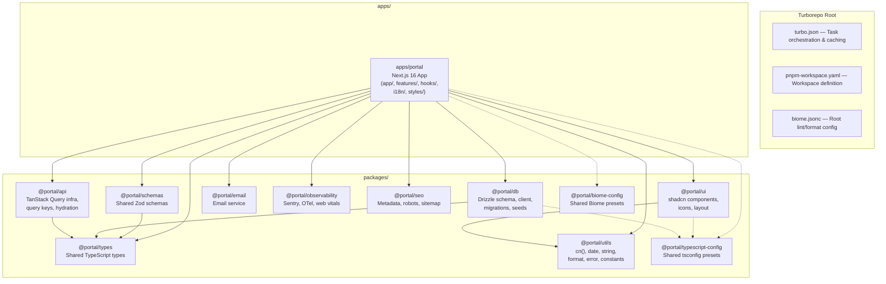
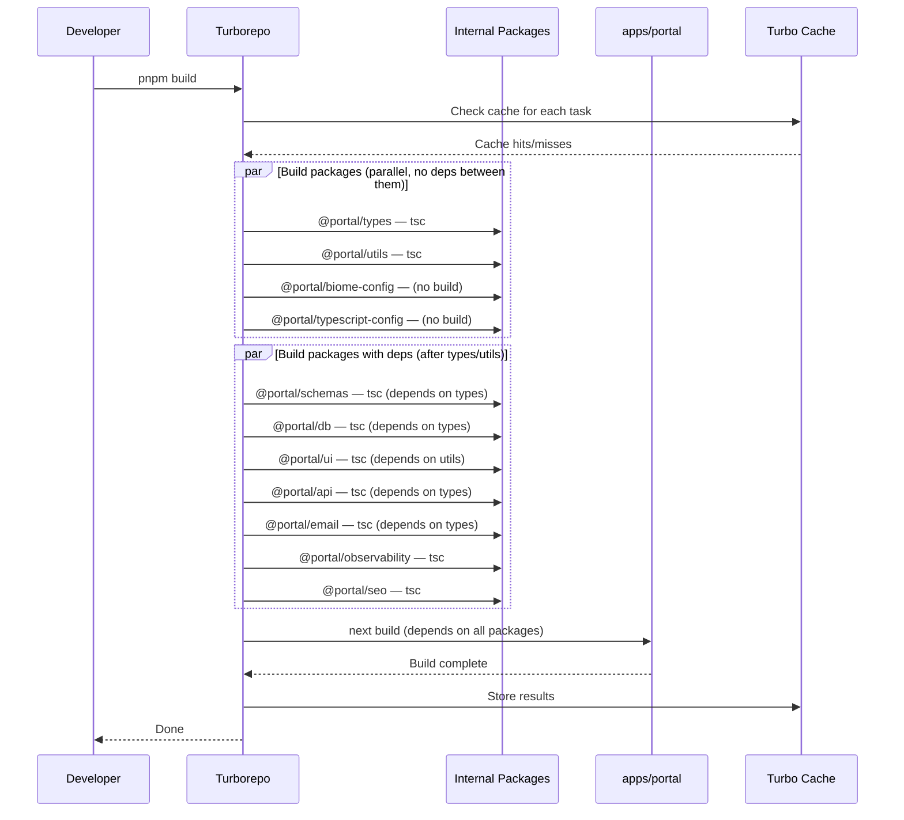
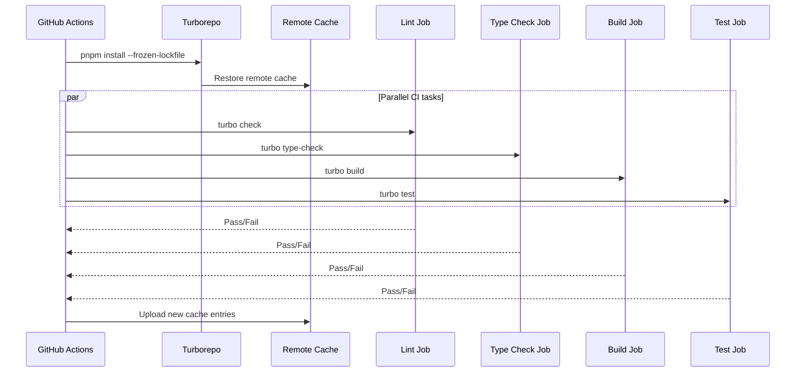

# Design Document: Turborepo Migration

## Overview

The Portal project is a single Next.js 16 application that serves as a centralized identity and hub management system for the AllThingsLinux community. As the project grows with multiple feature domains (admin, auth, integrations, blog, wiki, feed, user), shared infrastructure (database, email, observability, schemas), and UI components, the codebase benefits from a monorepo structure that enforces clear module boundaries, enables parallel task execution, and provides incremental build caching.

This design migrates the existing single-app structure into a Turborepo monorepo with internal packages extracted from `src/shared/` and `src/components/`, while keeping the Next.js application as the sole deployable app. The migration is incremental — the app continues to work at every step — and leverages Turborepo's task graph, caching, and environment variable handling to speed up CI and local development.

The key principle is **extract only what has clear, stable boundaries**. Feature modules (`src/features/`) remain inside the app because they are tightly coupled to Next.js routing, server components, and the app's auth/db context. Shared infrastructure and UI components are extracted into internal packages because they have well-defined interfaces and are consumed by the app (and potentially future apps/tools) as dependencies.

## Architecture



## Sequence Diagrams

### Build Pipeline



### CI Pipeline with Turborepo



## Components and Interfaces

### Component 1: Turborepo Root Configuration

**Purpose**: Orchestrates the monorepo — defines workspaces, task graph, caching rules, and environment variable passthrough.

**Key Files**:
- `turbo.json` — Task pipeline definitions, cache inputs/outputs, env vars
- `pnpm-workspace.yaml` — Workspace glob patterns
- `package.json` — Root scripts delegating to `turbo run`
- `biome.jsonc` — Root Biome config (extended by packages)

**Note**: No root `tsconfig.json` is needed. Each package extends `@portal/typescript-config` presets directly. A root tsconfig would cause all tasks to miss cache when it changes.

**Responsibilities**:
- Define task dependency graph (`build`, `check`, `type-check`, `test`, `dev`)
- Configure cache inputs (source files, configs) and outputs (`.next`, `dist`)
- Declare environment variable passthrough for Next.js build
- Provide root-level scripts for common operations

### Component 2: @portal/typescript-config

**Purpose**: Shared TypeScript configuration presets that all packages and apps extend.

**Interface**:
```typescript
// Exported tsconfig presets (JSON files, no code)
// packages/typescript-config/base.json     — Strict base config
// packages/typescript-config/nextjs.json   — Next.js app config (extends base)
// packages/typescript-config/library.json  — Internal package config (extends base)
```

**Responsibilities**:
- Single source of truth for compiler options (`strict`, `target`, `module`, etc.)
- Next.js preset includes JSX, App Router plugin, incremental builds
- Library preset uses `noEmit: true` for JIT packages (no build step needed)

**Note**: TypeScript project references (`composite`, `declaration`) are intentionally omitted. JIT packages resolve types directly from `.ts` source via the `exports` field's `types` condition. Turborepo handles dependency ordering, making project references redundant.

### Component 3: @portal/biome-config

**Purpose**: Shared Biome linting/formatting configuration built on Ultracite presets.

**Interface**:
```typescript
// packages/biome-config/biome.jsonc — Base Biome config
// Extended by each package's local biome.jsonc via "extends"
```

**Key detail**: The project uses **Ultracite** (`ultracite` npm package) as a zero-config Biome preset wrapper. The current `biome.jsonc` extends `ultracite/biome/core`, `ultracite/biome/react`, and `ultracite/biome/next`. The shared config must preserve this, not replace it.

**Current rules that must be preserved**:
- `noBarrelFile: "error"` with overrides for specific allowed barrel files (schemas, api, types index files)
- `noNamespaceImport: "error"` with overrides for integration implementations, Sentry files
- Complex import ordering config in `assist.actions.source.organizeImports` (React → UI libs → Next.js → form/validation → packages → internal aliases → relative)
- `files.includes` exclusion patterns (react-scan, references, components/ui, drizzle, cursor/skills)

**New barrel file overrides needed**: Since packages use direct exports via the wildcard `"./*"` pattern instead of barrel `index.ts` files, no new barrel file overrides are needed. The existing `noBarrelFile: "error"` rule applies cleanly to all packages. The only exception is `@portal/email` which has a single `"."` entry pointing to `./src/index.ts` (a single-file module, not a barrel re-export).

**Responsibilities**:
- Extend Ultracite presets (`ultracite/biome/core`, `ultracite/biome/react`, `ultracite/biome/next`)
- Centralize the `noBarrelFile` and `noNamespaceImport` rules with overrides
- Provide consistent import ordering rules (updated for `@portal/*` package imports)
- Allow per-package overrides via local `biome.jsonc`
- Root `biome.jsonc` extends `@portal/biome-config` and adds app-specific overrides

**Note**: `ultracite` and `@biomejs/biome` remain as root devDependencies. The `pnpm fix` and `pnpm check` scripts continue to use `ultracite fix` and `ultracite check` respectively, not raw `biome` commands.

### Component 4: @portal/types

**Purpose**: Shared TypeScript type definitions used across packages and the app.

**Interface**:
```typescript
// Current: src/shared/types/
// Becomes: packages/types/src/
// Consumers import specific subpaths (no barrel file):

import type { SessionData, AuthResult, UserPermissions, Permission } from "@portal/types/auth";
import type { UserListFilters, SessionListFilters, ApiResponse } from "@portal/types/api";
import type { RouteConfig, ProtectedRoute, BreadcrumbItem } from "@portal/types/routes";
import type { UserDTO, SessionDTO, ApiKeyDTO } from "@portal/types/common";
import type { EmailOptions } from "@portal/types/email";
```

**Responsibilities**:
- Provide type-only exports (no runtime code)
- Zero dependencies on other internal packages
- Foundation layer that other packages depend on
- Uses wildcard export `"./*"` — no barrel `index.ts`

### Component 5: @portal/utils

**Purpose**: Shared utility functions and constants.

**Interface**:
```typescript
// Current: src/shared/utils/
// Becomes: packages/utils/src/
// Consumers import specific subpaths (no barrel file):

import { cn } from "@portal/utils/utils";           // clsx + tailwind-merge
import { formatDate, ... } from "@portal/utils/date";
import { formatBytes, ... } from "@portal/utils/format";
import { slugify, ... } from "@portal/utils/string";
import { AppError, ... } from "@portal/utils/error";
import { USER_ROLES, PERMISSIONS, HTTP_STATUS, API_ERROR_CODES,
         QUERY_CACHE, RATE_LIMIT, PAGINATION, VALIDATION_PATTERNS,
         MOBILE_BREAKPOINT, DATE_FORMATS } from "@portal/utils/constants";
```

**Responsibilities**:
- Pure utility functions with no side effects
- Constants used across the app and packages
- Dependencies: `clsx`, `tailwind-merge`, `date-fns`

### Component 6: @portal/schemas

**Purpose**: Shared Zod validation schemas.

**Interface**:
```typescript
// Current: src/shared/schemas/
// Becomes: packages/schemas/src/
// Consumers import specific subpaths (no barrel file):

import { userSchema, updateUserSchema, ... } from "@portal/schemas/user";
import { ircAccountSchema, xmppAccountSchema, ... } from "@portal/schemas/integrations";
import { createPaginatedSchema, ... } from "@portal/schemas/utils";
```

**Responsibilities**:
- Zod schemas for API request/response validation
- Depends on `@portal/types` for type alignment
- Dependencies: `zod`, `zod-validation-error`

### Component 7: @portal/db

**Purpose**: Database layer — Drizzle ORM schema, client, relations, migrations.

**Interface**:
```typescript
// Current: src/shared/db/
// Becomes: packages/db/src/
// Consumers import specific subpaths (no barrel file):

import { db } from "@portal/db/client";
import { schema } from "@portal/db/schema";
import { relations } from "@portal/db/relations";
import { keys } from "@portal/db/keys";
```

**Responsibilities**:
- Drizzle schema definitions and relations
- Database client singleton with connection pooling
- Environment variable validation via `keys()`
- Drizzle Kit config for migrations (stays in package, `drizzle/` output at package level)
- Dependencies: `drizzle-orm`, `pg`, `@t3-oss/env-nextjs`, `zod`, `server-only`

### Component 8: @portal/ui

**Purpose**: Shared UI component library (shadcn/ui primitives + custom components).

**Interface**:
```typescript
// Current: src/components/
// Becomes: packages/ui/src/
// Consumers import specific subpaths (no barrel file):

// shadcn primitives
import { Button } from "@portal/ui/ui/button";
import { Card } from "@portal/ui/ui/card";
// ... all shadcn components via @portal/ui/ui/<name>

// Custom components
import { CommandMenu } from "@portal/ui/command-menu";
import { AppLayout, StatusBar, ... } from "@portal/ui/layout";
import { MailcowIcon } from "@portal/ui/icons/mailcow-icon";
```

**Responsibilities**:
- All shadcn/ui primitives (button, card, dialog, etc.)
- Layout components (app-layout, sidebar, header, navigation)
- Icon components
- Dependencies: `@radix-ui/*`, `lucide-react`, `class-variance-authority`, `tailwind-merge`, `clsx`, `cmdk`, `sonner`, `vaul`, `react-resizable-panels`, `embla-carousel-react`, `input-otp`, `react-day-picker`, `recharts`
- Depends on `@portal/utils` for `cn()`

### Component 9: @portal/observability

**Purpose**: Sentry integration, OpenTelemetry, web vitals reporting.

**Interface**:
```typescript
// Current: src/shared/observability/
// Becomes: packages/observability/src/
// Consumers import specific subpaths (no barrel file):

import { initSentryClient } from "@portal/observability/client";
import { initSentryServer } from "@portal/observability/server";
import { initSentryEdge } from "@portal/observability/edge";
import { keys } from "@portal/observability/keys";
import { captureException, setUser, ... } from "@portal/observability/helpers";
```

**Responsibilities**:
- Sentry SDK initialization for client, server, and edge runtimes
- Environment variable validation for Sentry config
- Web vitals attribution helpers
- Dependencies: `@sentry/nextjs`, `@t3-oss/env-nextjs`, `zod`

### Component 10: @portal/email

**Purpose**: Email sending service abstraction.

**Interface**:
```typescript
// Current: src/shared/email/
// Becomes: packages/email/src/
// Single-file module — uses "." entry point (not a barrel re-export):

import { sendEmail } from "@portal/email";
```

**Responsibilities**:
- Email provider abstraction (currently placeholder, future Resend integration)
- Depends on `@portal/types` for `EmailOptions`

### Component 11: @portal/seo

**Purpose**: SEO utilities — metadata generation, robots.txt, sitemap.

**Interface**:
```typescript
// Current: src/shared/seo/
// Becomes: packages/seo/src/
// Consumers import specific subpaths (no barrel file):

import { createPageMetadata, defaultMetadata, getRouteMetadata } from "@portal/seo/metadata";
import { generateRobots } from "@portal/seo/robots";
import { generateSitemap } from "@portal/seo/sitemap";
import { JsonLd } from "@portal/seo/json-ld";
```

**Responsibilities**:
- Next.js metadata generation helpers
- Structured data (JSON-LD) components
- Dependencies: `next`, `schema-dts`

### Component 12: @portal/api

**Purpose**: TanStack Query infrastructure — query client, keys, hydration, server queries.

**Interface**:
```typescript
// Current: src/shared/api/
// Becomes: packages/api/src/
// Consumers import specific subpaths (no barrel file):

import { getQueryClient } from "@portal/api/query-client";
import { queryKeys } from "@portal/api/query-keys";
import { HydrationBoundary, prefetchQuery } from "@portal/api/hydration";
import { createServerQuery } from "@portal/api/server-queries";
```

**Responsibilities**:
- TanStack Query client factory with default options
- Centralized query key factory
- Server-side query prefetching and hydration
- Depends on `@portal/types` for filter types
- Dependencies: `@tanstack/react-query`

### Component 13: apps/portal (Next.js App)

**Purpose**: The main deployable application — all routes, features, middleware, and app-specific logic.

**Interface**:
```typescript
// Consumes all @portal/* packages
// Retains: app/, features/, hooks/, i18n/, styles/, env.ts, proxy.ts,
//          instrumentation.ts, sentry configs
// Key files: turbo.json (package-level overrides for typegen dependency)
```

**Responsibilities**:
- Next.js App Router pages and API routes
- Feature modules (admin, auth, integrations, blog, wiki, feed, user)
- React hooks specific to the app
- Middleware (proxy.ts)
- Environment variable aggregation (env.ts)
- Sentry instrumentation files
- All app-specific configuration (next.config.ts, components.json, postcss)

**Critical: next.config.ts imports**: The current `next.config.ts` imports from `./src/shared/next-config` using relative paths. After migration, `src/shared/next-config/` stays inside `apps/portal/src/shared/next-config/`, so the relative import paths remain valid. However, the `@/shared/observability/keys` dynamic import in the `headers()` function uses the `@/` alias, which must still resolve correctly within `apps/portal/`.

**Critical: tsx scripts**: Several scripts use `tsx` to run TypeScript files directly (`db:wipe`, `db:seed`, `create-admin`, `create-mailcow-oauth-client`). These scripts stay in `apps/portal/scripts/` and their `package.json` script entries use relative paths (e.g., `tsx scripts/seed.ts`).

## Data Models

### Target Directory Structure

```
portal/                              # Turborepo root
├── apps/
│   └── portal/                      # Next.js 16 app
│       ├── src/
│       │   ├── app/                 # App Router (unchanged)
│       │   ├── features/            # Feature modules (unchanged)
│       │   ├── hooks/               # App-specific hooks
│       │   ├── i18n/                # next-intl config
│       │   ├── styles/              # globals.css
│       │   ├── env.ts               # Aggregated env validation
│       │   ├── proxy.ts             # Middleware
│       │   ├── instrumentation.ts   # Sentry instrumentation
│       │   ├── sentry.edge.config.ts
│       │   └── sentry.server.config.ts
│       ├── public/                  # Static assets
│       ├── locale/                  # i18n translations
│       ├── tests/                   # Test suites
│       ├── scripts/                 # Utility scripts
│       ├── drizzle/                 # Migration output (from @portal/db)
│       ├── next.config.ts
│       ├── vitest.config.ts
│       ├── postcss.config.mjs
│       ├── components.json          # shadcn config
│       ├── tsconfig.json            # Extends @portal/typescript-config/nextjs
│       ├── biome.jsonc              # Extends @portal/biome-config
│       ├── turbo.json               # Package-level turbo overrides (typegen dep)
│       ├── .env                     # Environment variables (app-owned)
│       └── package.json
├── packages/
│   ├── typescript-config/           # @portal/typescript-config
│   │   ├── base.json
│   │   ├── nextjs.json
│   │   ├── library.json
│   │   └── package.json
│   ├── biome-config/                # @portal/biome-config
│   │   ├── biome.jsonc
│   │   └── package.json
│   ├── types/                       # @portal/types
│   │   ├── src/
│   │   │   ├── api.ts
│   │   │   ├── auth.ts
│   │   │   ├── common.ts
│   │   │   ├── email.ts
│   │   │   └── routes.ts
│   │   ├── tsconfig.json
│   │   └── package.json
│   ├── utils/                       # @portal/utils
│   │   ├── src/
│   │   │   ├── constants.ts
│   │   │   ├── date.ts
│   │   │   ├── email.ts
│   │   │   ├── error.ts
│   │   │   ├── format.ts
│   │   │   ├── string.ts
│   │   │   └── utils.ts
│   │   ├── tsconfig.json
│   │   └── package.json
│   ├── schemas/                     # @portal/schemas
│   │   ├── src/
│   │   │   ├── integrations/
│   │   │   ├── user.ts
│   │   │   └── utils.ts
│   │   ├── tsconfig.json
│   │   └── package.json
│   ├── db/                          # @portal/db
│   │   ├── src/
│   │   │   ├── schema/
│   │   │   ├── client.ts
│   │   │   ├── config.ts
│   │   │   ├── keys.ts
│   │   │   └── relations.ts
│   │   ├── drizzle/                 # Migration files
│   │   ├── tsconfig.json
│   │   └── package.json
│   ├── ui/                          # @portal/ui
│   │   ├── src/
│   │   │   ├── ui/                  # shadcn primitives
│   │   │   ├── icons/
│   │   │   ├── layout/
│   │   │   ├── command-menu.tsx
│   │   │   └── dev-tools.tsx
│   │   ├── tsconfig.json
│   │   └── package.json
│   ├── api/                         # @portal/api
│   │   ├── src/
│   │   │   ├── hydration.ts
│   │   │   ├── query-client.ts
│   │   │   ├── query-keys.ts
│   │   │   ├── server-queries.ts
│   │   │   ├── types.ts
│   │   │   └── utils.ts
│   │   ├── tsconfig.json
│   │   └── package.json
│   ├── email/                       # @portal/email
│   │   ├── src/
│   │   │   └── index.ts
│   │   ├── tsconfig.json
│   │   └── package.json
│   ├── observability/               # @portal/observability
│   │   ├── src/
│   │   │   ├── client.ts
│   │   │   ├── edge.ts
│   │   │   ├── server.ts
│   │   │   ├── helpers.ts
│   │   │   ├── keys.ts
│   │   │   ├── utils.ts
│   │   │   └── wide-events.ts
│   │   ├── tsconfig.json
│   │   └── package.json
│   └── seo/                         # @portal/seo
│       ├── src/
│       │   ├── json-ld.tsx
│       │   ├── metadata.ts
│       │   ├── robots.ts
│       │   └── sitemap.ts
│       ├── tsconfig.json
│       └── package.json
├── .github/workflows/               # Updated CI/CD
├── turbo.json                       # Turborepo config
├── pnpm-workspace.yaml              # Workspace definition
├── biome.jsonc                      # Root Biome (extends @portal/biome-config)
├── Containerfile                    # Updated for monorepo
├── compose.yaml                     # Docker Compose (unchanged)
└── package.json                     # Root package.json
```

### Import Alias Mapping

The migration rewrites `@/` path aliases to package imports:

| Before (path alias)                    | After (package import)                     |
|----------------------------------------|--------------------------------------------|
| `@/shared/types/auth`                  | `@portal/types/auth`                       |
| `@/shared/utils`                       | `@portal/utils/utils`                      |
| `@/shared/utils/constants`             | `@portal/utils/constants`                  |
| `@/shared/schemas`                     | `@portal/schemas/user` (or specific file)  |
| `@/db`                                 | `@portal/db/client`                        |
| `@/db/schema`                          | `@portal/db/schema`                        |
| `@/components/ui/button`               | `@portal/ui/ui/button`                     |
| `@/components/layout`                  | `@portal/ui/layout`                        |
| `@/shared/api`                         | `@portal/api/query-client` (or specific)   |
| `@/shared/email`                       | `@portal/email`                            |
| `@/shared/observability`               | `@portal/observability/client` (or specific)|
| `@/shared/seo`                         | `@portal/seo/metadata` (or specific)       |
| `@/auth` (features/auth/lib)           | `@/auth` (stays — app-internal)            |
| `@/features/*`                         | `@/features/*` (stays — app-internal)      |
| `@/hooks/*`                            | `@/hooks/*` (stays — app-internal)         |
| `@/config`                             | `@/config` (stays — app-internal)          |
| `@/env`                                | `@/env` (stays — app-internal)             |

Note: `@/` inside `apps/portal` still resolves to `apps/portal/src/` for app-internal imports. Only shared modules become package imports. Packages use direct subpath imports (e.g., `@portal/utils/constants`) instead of barrel re-exports, aligning with the `noBarrelFile: "error"` Biome rule. The exception is `@portal/email` which uses `"."` since it's a single-file module.

**Existing dedicated aliases that change**:
- `@/db` / `@/db/*` → `@portal/db` / `@portal/db/*` (currently aliased to `src/shared/db`)
- `@/ui/*` → `@portal/ui/ui/*` (currently aliased to `src/components/ui/*`)

**Existing dedicated aliases that stay**:
- `@/auth` / `@/auth/*` → stays (maps to `src/features/auth/lib`, app-internal)
- `@/config` / `@/config/*` → stays (maps to `src/shared/config`, app-internal)

## Key Functions with Formal Specifications

### Function 1: Internal Package Resolution (Turborepo "Just-in-Time" Packages)

```typescript
// packages/utils/package.json
{
  "name": "@portal/utils",
  "version": "0.0.0",
  "private": true,
  "type": "module",
  "exports": {
    "./*": { "types": "./src/*.ts", "default": "./src/*.ts" }
  },
  "scripts": {
    "check": "biome check .",
    "fix": "biome fix .",
    "type-check": "tsc --noEmit"
  },
  "dependencies": {
    "clsx": "^2.1.1",
    "date-fns": "^4.1.0",
    "tailwind-merge": "^3.4.0"
  },
  "devDependencies": {
    "@portal/typescript-config": "workspace:*",
    "typescript": "^5.9.3"
  }
}
```

**Note on per-package scripts**: Each package declares its own `check`, `fix`, and `type-check` scripts. This enables Turborepo to run these tasks in parallel across all packages. The `biome` CLI is available via the root `@biomejs/biome` devDependency, and config resolution walks up the directory tree to find the nearest `biome.jsonc`.

**Note on exports**: Packages use only the wildcard export `"./*"` instead of a `"."` barrel entry. This aligns with the project's `noBarrelFile: "error"` Biome rule. Consumers import specific subpaths (e.g., `@portal/utils/constants`, `@portal/utils/utils`). For packages with a single file like `@portal/email`, `"."` points directly to that file (not a barrel re-export).

**Preconditions:**
- Package `exports` field points directly to TypeScript source files (no build step needed)
- The consuming app's bundler (Next.js/Turbopack) transpiles the source at build time
- `private: true` prevents accidental publishing to npm

**Postconditions:**
- `import { cn } from "@portal/utils/utils"` resolves to `packages/utils/src/utils.ts`
- `import { USER_ROLES } from "@portal/utils/constants"` resolves to `packages/utils/src/constants.ts`
- TypeScript types are resolved from source via the `types` condition in `exports`

### Function 2: turbo.json Task Pipeline

```typescript
// turbo.json
{
  "$schema": "https://turborepo.dev/schema.json",
  "tasks": {
    "build": {
      "dependsOn": ["^build"],
      "inputs": ["src/**", "tsconfig.json", "package.json", ".env", ".env.*"],
      "outputs": [".next/**", "!.next/cache/**"],
      "env": [
        "DATABASE_URL",
        "BETTER_AUTH_SECRET",
        "BETTER_AUTH_URL",
        "NODE_ENV",
        "NEXT_PUBLIC_*",
        "SENTRY_*",
        "GIT_COMMIT_SHA"
      ]
    },
    "transit": {
      "dependsOn": ["^transit"]
    },
    "check": {
      "dependsOn": ["transit"],
      "inputs": ["src/**", "biome.jsonc"],
      "outputs": []
    },
    "fix": {
      "dependsOn": [],
      "inputs": ["src/**", "biome.jsonc"],
      "outputs": [],
      "cache": false
    },
    "typegen": {
      "inputs": ["src/app/**"],
      "outputs": [".next/types/**"],
      "cache": false
    },
    "type-check": {
      "dependsOn": ["transit"],
      "inputs": ["src/**", "tsconfig.json"],
      "outputs": []
    },
    "test": {
      "dependsOn": ["^build"],
      "inputs": ["src/**", "tests/**", "vitest.config.ts", ".env", ".env.*"],
      "outputs": ["coverage/**"],
      "env": ["DATABASE_URL"]
    },
    "dev": {
      "dependsOn": ["^build"],
      "persistent": true,
      "cache": false
    },
    "db:generate": {
      "inputs": ["src/schema/**"],
      "outputs": ["drizzle/**"],
      "cache": false
    },
    "db:migrate": {
      "cache": false
    },
    "db:push": {
      "cache": false
    }
  },
  "globalDependencies": ["pnpm-lock.yaml"],
  "globalEnv": ["NODE_ENV"]
}
```

**Transit node pattern**: The `transit` task is a virtual task with no script — it exists solely to propagate cache invalidation through the dependency graph. `check` and `type-check` depend on `transit` instead of `^build` because they read source files from dependencies but don't need their build outputs. When a dependency's source changes, `transit` invalidates, which in turn invalidates `check` and `type-check` in downstream packages. This enables these tasks to run in parallel without waiting for unnecessary builds.

**Package-level turbo.json for apps/portal**: The `typegen` dependency is specific to the Next.js app (only `apps/portal` needs RouteContext types). Instead of polluting the root turbo.json, `apps/portal/turbo.json` overrides `type-check` and `build` to depend on `typegen`:

```typescript
// apps/portal/turbo.json
{
  "extends": ["//"],
  "tasks": {
    "type-check": {
      "dependsOn": ["transit", "typegen"]
    },
    "build": {
      "dependsOn": ["^build", "typegen"]
    }
  }
}
```

**Critical: typegen dependency**: Next.js 16 generates `RouteContext` types via `next typegen`. The `type-check` task in `apps/portal` depends on `typegen` to ensure these types exist before `tsc --noEmit` runs. Without this, `TS2304: Cannot find name 'RouteContext'` errors occur. This dependency is scoped to `apps/portal/turbo.json` because no other package needs it.

**Note on `.env` in task inputs**: Turbo does NOT load `.env` files — the framework (Next.js) does. But Turbo needs to know about `.env` changes to invalidate cache correctly. The `.env` and `.env.*` patterns are included in `build` and `test` inputs so that env var changes trigger rebuilds. Since `.env` lives in `apps/portal/`, the inputs are relative to that package.

**Note on `fix` task**: The `fix` task runs `ultracite fix` (not `biome fix`). It's not cached because it modifies files in place. The `check` task runs `ultracite check` and can be cached.
```

**Preconditions:**
- All packages declare their `build` script (or have none if JIT)
- `^build` means "build my dependencies first"
- Environment variables listed in `env` are included in cache key

**Postconditions:**
- Tasks run in correct dependency order
- Cache is invalidated when source files, configs, or env vars change
- `dev` task is never cached (persistent process)
- Database tasks are never cached (side effects)

**Loop Invariants:**
- For each task in the dependency graph: all upstream tasks complete before downstream starts
- Cache key = hash(inputs + env + dependencies' outputs)

### Function 3: pnpm-workspace.yaml Configuration

```yaml
# pnpm-workspace.yaml (root)
packages:
  - "apps/*"
  - "packages/*"

onlyBuiltDependencies:
  - core-js
  - esbuild
  - sharp
  - unrs-resolver
```

**Preconditions:**
- All directories under `apps/` and `packages/` contain valid `package.json` files
- Each package has a unique `name` field

**Postconditions:**
- `pnpm install` links all workspace packages
- `workspace:*` protocol resolves to local packages
- `pnpm --filter @portal/ui add react` installs to the correct package

### Function 4: Root package.json Scripts

```typescript
// package.json (root)
{
  "name": "portal-monorepo",
  "version": "0.0.0",
  "private": true,
  "scripts": {
    "preinstall": "npx only-allow pnpm",
    "deduplicate": "pnpm dedupe",
    "build": "turbo run build",
    "dev": "turbo run dev",
    "check": "turbo run check",
    "fix": "turbo run fix",
    "type-check": "turbo run type-check",
    "test": "turbo run test",
    "test:watch": "pnpm --filter apps/portal test:watch",
    "test:coverage": "turbo run test:coverage",
    "typegen": "pnpm --filter apps/portal typegen",
    "db:generate": "pnpm --filter @portal/db db:generate",
    "db:migrate": "pnpm --filter @portal/db db:migrate",
    "db:push": "pnpm --filter @portal/db db:push",
    "db:studio": "pnpm --filter @portal/db db:studio",
    "db:wipe": "pnpm --filter apps/portal db:wipe",
    "db:seed": "pnpm --filter apps/portal db:seed",
    "db:seed:reset": "pnpm --filter apps/portal db:seed:reset",
    "auth:init-schema": "pnpm --filter apps/portal auth:init-schema",
    "create-admin": "pnpm --filter apps/portal create-admin",
    "create-mailcow-oauth-client": "pnpm --filter apps/portal create-mailcow-oauth-client",
    "compose:db": "docker compose up -d portal-db",
    "compose:db:down": "docker compose down",
    "compose:production": "docker compose --profile production up -d",
    "compose:production:down": "docker compose --profile production down",
    "compose:staging": "docker compose --profile staging up -d",
    "compose:staging:down": "docker compose --profile staging down",
    "compose:adminer": "docker compose --profile adminer up -d",
    "compose:adminer:down": "docker compose --profile adminer down",
    "release": "pnpm --filter apps/portal release"
  },
  "devDependencies": {
    "turbo": "^2.5.0"
  },
  "packageManager": "pnpm@10.28.2",
  "engines": {
    "pnpm": "10.28.2",
    "node": ">=20.19.0"
  }
}
```

**Note on Husky/lint-staged/commitlint**: These tools must remain at the monorepo root level. `husky` hooks run from the git root, `lint-staged` runs Biome on staged files, and `commitlint` validates commit messages. Their configs (`.husky/`, `.lintstagedrc.json`, `.commitlintrc.json`) stay at root. The `lint-staged` config may need path updates if it references `src/` directly.

**Note on semantic-release**: The `release` script delegates to `apps/portal` where `semantic-release` and its plugins (`@semantic-release/changelog`, `@semantic-release/git`, `@semantic-release/exec`) remain as devDependencies. The `.releaserc.json` stays at root or moves to `apps/portal/`.

**Note on typegen gotcha**: `pnpm typegen` (which runs `next typegen`) must execute before `pnpm type-check`. In the turbo pipeline, `apps/portal/turbo.json` overrides `type-check` to depend on `typegen`, so this is handled automatically when running `turbo run type-check`.
```

**Preconditions:**
- `turbo` is installed as a root devDependency
- `turbo.json` exists at root with task definitions

**Postconditions:**
- `pnpm build` triggers `turbo run build` which builds all packages then the app
- `pnpm dev` starts the Next.js dev server with package watching
- Database commands are scoped to the correct package/app
- `pnpm fix` runs Biome across all packages

### Function 5: TypeScript Config Presets

```typescript
// packages/typescript-config/base.json
{
  "$schema": "https://json.schemastore.org/tsconfig",
  "compilerOptions": {
    "target": "ESNext",
    "lib": ["ESNext"],
    "module": "ESNext",
    "moduleResolution": "bundler",
    "resolveJsonModule": true,
    "isolatedModules": true,
    "strict": true,
    "forceConsistentCasingInFileNames": true,
    "noFallthroughCasesInSwitch": true,
    "skipLibCheck": true,
    "esModuleInterop": true
  }
}

// packages/typescript-config/nextjs.json
{
  "$schema": "https://json.schemastore.org/tsconfig",
  "extends": "./base.json",
  "compilerOptions": {
    "lib": ["dom", "dom.iterable", "ESNext"],
    "jsx": "react-jsx",
    "noEmit": true,
    "incremental": true,
    "plugins": [{ "name": "next" }]
  }
}

// packages/typescript-config/library.json
{
  "$schema": "https://json.schemastore.org/tsconfig",
  "extends": "./base.json",
  "compilerOptions": {
    "lib": ["ESNext", "dom", "dom.iterable"],
    "jsx": "react-jsx",
    "noEmit": true
  }
}
```

**Preconditions:**
- All packages reference these via `"extends": "@portal/typescript-config/library.json"`
- The app references via `"extends": "@portal/typescript-config/nextjs.json"`

**Postconditions:**
- Consistent compiler options across all packages
- JIT packages use `noEmit: true` — types resolve from `.ts` source via `exports`
- Next.js app config includes JSX and App Router plugin

### Function 6: Internal Package Template (JIT Pattern)

```typescript
// Example: packages/schemas/package.json
{
  "name": "@portal/schemas",
  "version": "0.0.0",
  "private": true,
  "type": "module",
  "exports": {
    "./*": { "types": "./src/*.ts", "default": "./src/*.ts" }
  },
  "scripts": {
    "check": "biome check .",
    "fix": "biome fix .",
    "type-check": "tsc --noEmit"
  },
  "dependencies": {
    "@portal/types": "workspace:*",
    "zod": "^4.3.5",
    "zod-validation-error": "^5.0.0"
  },
  "devDependencies": {
    "@portal/typescript-config": "workspace:*",
    "typescript": "^5.9.3"
  }
}

// packages/schemas/tsconfig.json
{
  "extends": "@portal/typescript-config/library.json",
  "compilerOptions": {
    "baseUrl": ".",
    "paths": {}
  },
  "include": ["src/**/*.ts"]
}
```

**Preconditions:**
- `exports` points to raw `.ts` source (no build step)
- `workspace:*` resolves to local packages
- No `build` script needed — the consuming bundler handles transpilation
- Each package has `check`, `fix`, and `type-check` scripts for Turborepo parallel execution

**Postconditions:**
- Package is immediately usable after `pnpm install`
- TypeScript resolves types from source
- Changes to source files trigger Turbo cache invalidation in consumers
- `turbo run check` and `turbo run type-check` run across all packages in parallel

## Algorithmic Pseudocode

### Migration Algorithm (Incremental, Non-Breaking)

```typescript
ALGORITHM migrateToTurborepo()
INPUT: existing single-app Portal project
OUTPUT: working Turborepo monorepo with identical functionality

// Phase 1: Scaffold monorepo root (no code moves yet)
STEP 1: Install turbo as root devDependency
STEP 2: Create turbo.json with task pipeline
STEP 3: Update pnpm-workspace.yaml to include apps/* and packages/*
STEP 4: Create apps/portal/ directory
STEP 5: Create packages/typescript-config/ with base, nextjs, library presets
STEP 6: Create packages/biome-config/ with shared biome.jsonc

// ASSERT: pnpm install succeeds, no packages moved yet

// Phase 2: Move app into apps/portal/
STEP 7: Move src/, public/, locale/, tests/, scripts/, drizzle/ into apps/portal/
STEP 8: Move app config files (next.config.ts, vitest.config.ts, postcss.config.mjs,
         components.json, tsconfig.json) into apps/portal/
STEP 9: Move app-specific root files (proxy.ts → already in src/)
STEP 10: Create apps/portal/package.json with app dependencies
STEP 11: Update apps/portal/tsconfig.json to extend @portal/typescript-config/nextjs
STEP 12: Update root package.json scripts to use turbo run

// ASSERT: pnpm build succeeds from root (single app, no packages yet)
// ASSERT: pnpm dev works (user verifies manually)

// Phase 3: Extract packages one at a time (leaf-first)
// Extract in dependency order: leaves first, then dependents

STEP 13: Extract @portal/types from src/shared/types/
  - Create packages/types/package.json and tsconfig.json
  - Move type files to packages/types/src/
  - Add @portal/types as dependency in apps/portal/package.json
  - Update imports: @/shared/types/* → @portal/types/*
  // ASSERT: pnpm type-check passes

STEP 14: Extract @portal/utils from src/shared/utils/
  - Create packages/utils/package.json (deps: clsx, tailwind-merge, date-fns)
  - Move utility files to packages/utils/src/
  - Add @portal/utils as dependency in apps/portal/package.json
  - Update imports: @/shared/utils/* → @portal/utils/*
  // ASSERT: pnpm type-check passes

STEP 15: Extract @portal/schemas from src/shared/schemas/
  - Depends on @portal/types
  - Move schema files to packages/schemas/src/
  - Update imports
  // ASSERT: pnpm type-check passes

STEP 16: Extract @portal/db from src/shared/db/
  - Depends on @portal/types
  - Move db files to packages/db/src/
  - Move drizzle/ migrations to packages/db/drizzle/
  - Update drizzle-kit config path references
  - Update imports: @/db/* → @portal/db/*
  // ASSERT: pnpm type-check passes, db:generate works

STEP 17: Extract @portal/email from src/shared/email/
  - Depends on @portal/types
  - Move email files to packages/email/src/
  // ASSERT: pnpm type-check passes

STEP 18: Extract @portal/observability from src/shared/observability/
  - Move observability files to packages/observability/src/
  // ASSERT: pnpm type-check passes

STEP 19: Extract @portal/seo from src/shared/seo/
  - Move seo files to packages/seo/src/
  // ASSERT: pnpm type-check passes

STEP 20: Extract @portal/api from src/shared/api/
  - Depends on @portal/types
  - Move api infra files to packages/api/src/
  // ASSERT: pnpm type-check passes

STEP 21: Extract @portal/ui from src/components/
  - Depends on @portal/utils (for cn())
  - Move all component files to packages/ui/src/
  - Update shadcn components.json paths
  - Update imports: @/components/* → @portal/ui/*
  // ASSERT: pnpm type-check passes

// Phase 4: Update CI/CD, Docker, and tooling
STEP 22: Update .github/workflows/ci.yml for monorepo paths
  - Update change detection file patterns to include packages/**
  - Update Next.js cache path to apps/portal/.next/cache
  - Update coverage upload path to apps/portal/coverage/lcov.info
  - Keep separate jobs structure (changes, lint, type-check, build, test, release)
STEP 23: Update Containerfile for monorepo (turbo prune --docker)
STEP 24: Update .dockerignore for new structure
STEP 25: Move .env from root to apps/portal/.env
  - Update any scripts or documentation that reference the root .env path
  - The @portal/db package's keys.ts uses @t3-oss/env-nextjs which loads .env
    from the Next.js app root automatically
  - Since this is a single-app monorepo, all env vars are consumed by apps/portal.
    Placing .env in apps/portal/ makes ownership clear and avoids the root .env
    anti-pattern
STEP 26: Move husky/lint-staged/commitlint to monorepo root
  - .husky/ stays at root (git hooks run from git root)
  - .commitlintrc.json stays at root
  - .lintstagedrc.json stays at root, update paths if needed
  - husky remains a root devDependency
STEP 27: Update semantic-release config
  - .releaserc.json stays at root or moves to apps/portal
  - Ensure release plugins reference correct paths for CHANGELOG.md and package.json

// ASSERT: Full CI pipeline passes
// ASSERT: Docker build produces working image
// ASSERT: pnpm build succeeds
// ASSERT: All tests pass
```

**Preconditions:**
- Git working tree is clean before starting
- All existing tests pass before migration
- Node.js >= 20.19.0 and pnpm 10.28.2 are available

**Postconditions:**
- All existing functionality is preserved
- All tests pass
- CI pipeline works with Turborepo caching
- Docker build produces identical production image
- `pnpm build` from root builds all packages then the app
- Import paths are updated consistently

**Loop Invariants:**
- After each STEP, `pnpm install` succeeds
- After each package extraction, `pnpm type-check` passes
- The app can be built and run at any intermediate step

### Docker Build Algorithm (Monorepo-Aware)

```typescript
ALGORITHM buildDockerImage()
INPUT: Turborepo monorepo root
OUTPUT: Minimal production Docker image for apps/portal

// Stage 1: Prune — use turbo prune to create minimal install context
// turbo prune generates a pruned workspace with only the packages
// that apps/portal depends on, plus a lockfile subset
RUN turbo prune @portal/portal --docker

// This produces:
//   out/json/        — package.json files only (for install layer caching)
//   out/full/        — full source for pruned packages
//   out/pnpm-lock.yaml — subset lockfile

// Stage 2: Install dependencies (cached layer)
COPY out/json/ .
COPY out/pnpm-lock.yaml .
RUN pnpm install --frozen-lockfile

// Stage 3: Build
COPY out/full/ .
RUN turbo run build --filter=@portal/portal

// Stage 4: Runner (production)
COPY standalone output + static + public
```

**Preconditions:**
- `turbo` CLI is available in the Docker build context
- `turbo prune` correctly identifies all transitive dependencies

**Postconditions:**
- Docker image contains only the production runtime (standalone output)
- Layer caching is maximized: dependency install layer only rebuilds when lockfile changes
- Image size is comparable to current single-app image

### Containerfile (Updated)

```dockerfile
# Stage 1: Prune workspace for the portal app
FROM node:22-alpine AS pruner
RUN apk add --no-cache libc6-compat
WORKDIR /app
RUN corepack enable && corepack prepare pnpm@10.28.2 --activate
RUN pnpm add -g turbo@^2
COPY . .
RUN turbo prune @portal/portal --docker

# Stage 2: Install dependencies
FROM node:22-alpine AS deps
RUN apk add --no-cache libc6-compat
WORKDIR /app
RUN corepack enable && corepack prepare pnpm@10.28.2 --activate
COPY --from=pruner /app/out/json/ .
RUN pnpm install --frozen-lockfile

# Stage 3: Build
FROM node:22-alpine AS builder
WORKDIR /app
RUN corepack enable && corepack prepare pnpm@10.28.2 --activate
COPY --from=deps /app/ .
COPY --from=pruner /app/out/full/ .

ARG NODE_ENV=production
ENV NODE_ENV=$NODE_ENV
ARG BETTER_AUTH_SECRET
ENV BETTER_AUTH_SECRET=$BETTER_AUTH_SECRET
ARG BETTER_AUTH_URL
ENV BETTER_AUTH_URL=$BETTER_AUTH_URL
ARG GIT_COMMIT_SHA
ENV GIT_COMMIT_SHA=$GIT_COMMIT_SHA
ENV NEXT_TELEMETRY_DISABLED=1

RUN pnpm turbo run build --filter=@portal/portal

# Stage 4: Runner
FROM node:22-alpine AS runner
WORKDIR /app
ENV NODE_ENV=production
ENV NEXT_TELEMETRY_DISABLED=1

RUN addgroup --system --gid 1001 nodejs && \
    adduser --system --uid 1001 nextjs

COPY --from=builder /app/apps/portal/public ./public
COPY --from=builder --chown=nextjs:nodejs /app/apps/portal/.next/standalone ./
COPY --from=builder --chown=nextjs:nodejs /app/apps/portal/.next/static ./.next/static

RUN chown -R nextjs:nodejs /app
USER nextjs
EXPOSE 3000
ENV PORT=3000
ENV HOSTNAME="0.0.0.0"

HEALTHCHECK --interval=30s --timeout=10s --start-period=40s --retries=3 \
  CMD node -e "require('http').get('http://localhost:3000/api/health', (r) => {process.exit(r.statusCode === 200 ? 0 : 1)})"

CMD ["node", "server.js"]
```

## Example Usage

### Installing and running from root

```typescript
// Install all workspace dependencies
pnpm install

// Build everything (Turborepo resolves dependency order)
pnpm build

// Run dev server (user runs manually)
// pnpm dev

// Lint and format all packages
pnpm fix

// Type-check all packages
pnpm type-check

// Run all tests
pnpm test

// Database operations (scoped to @portal/db)
pnpm db:generate
pnpm db:migrate
pnpm db:push
```

### Filtering to specific packages

```typescript
// Build only the portal app and its dependencies
pnpm turbo run build --filter=@portal/portal

// Type-check only the UI package
pnpm turbo run type-check --filter=@portal/ui

// Run tests only in the app
pnpm turbo run test --filter=@portal/portal

// Add a dependency to a specific package
pnpm --filter @portal/ui add lucide-react
pnpm --filter @portal/db add drizzle-orm
```

### Importing from internal packages (in app code)

```typescript
// Before (path aliases)
import { cn } from "@/shared/utils/utils";
import { USER_ROLES } from "@/shared/utils/constants";
import type { SessionData } from "@/shared/types/auth";
import { Button } from "@/components/ui/button";
import { db } from "@/db";
import { userSchema } from "@/shared/schemas";
import { queryKeys } from "@/shared/api";
import { sendEmail } from "@/shared/email";

// After (package imports — direct subpaths, no barrels)
import { cn } from "@portal/utils/utils";
import { USER_ROLES } from "@portal/utils/constants";
import type { SessionData } from "@portal/types/auth";
import { Button } from "@portal/ui/ui/button";
import { db } from "@portal/db/client";
import { userSchema } from "@portal/schemas/user";
import { queryKeys } from "@portal/api/query-keys";
import { sendEmail } from "@portal/email";

// App-internal imports stay the same
import { auth } from "@/auth";
import { env } from "@/env";
import { AdminDashboard } from "@/features/admin/components/dashboard";
import { usePermissions } from "@/hooks/use-permissions";
```

### CI workflow usage

The existing CI workflow structure (separate jobs for lint, type-check, build, test with change detection) should be preserved but updated to use `turbo run`. The current CI has:
- A `changes` job that detects file changes (TypeScript, config, tests) using `tj-actions/changed-files`
- Conditional job execution based on changed files
- Next.js build cache via `actions/cache`
- A `release` job with semantic-release (runs after all checks pass on `main`)
- Build env var placeholders (`DATABASE_URL`, `BETTER_AUTH_SECRET`)

Key updates for monorepo:
- Change detection paths must include `packages/**` in addition to `apps/portal/src/**`
- Each job replaces direct commands with `turbo run` equivalents
- Next.js build cache path changes from `.next/cache` to `apps/portal/.next/cache`
- `pnpm-lock.yaml` hash key stays the same (still at root)

```yaml
# .github/workflows/ci.yml (updated — key changes only)
jobs:
  changes:
    # Update file patterns to include packages/
    steps:
      - name: Check TypeScript
        with:
          files: |
            apps/portal/src/**/*.{ts,tsx}
            packages/*/src/**/*.{ts,tsx}
            **/tsconfig.json
            package.json
            pnpm-lock.yaml

  lint:
    steps:
      - run: pnpm check  # turbo run check under the hood

  type-check:
    steps:
      - run: pnpm typegen  # next typegen in apps/portal
      - run: pnpm type-check  # turbo run type-check

  build:
    steps:
      - name: Cache Next.js build
        with:
          path: apps/portal/.next/cache  # Updated path
      - run: pnpm build  # turbo run build

  test:
    steps:
      - run: pnpm test:coverage  # turbo run test:coverage
      - name: Upload coverage
        with:
          files: ./apps/portal/coverage/lcov.info  # Updated path

  release:
    # Unchanged — still runs pnpm run release after all checks pass
```

## Correctness Properties

*A property is a characteristic or behavior that should hold true across all valid executions of a system — essentially, a formal statement about what the system should do. Properties serve as the bridge between human-readable specifications and machine-verifiable correctness guarantees.*

### Property 1: Dependency acyclicity

*For all* pairs of internal packages (A, B) in the workspace, if A declares B as a dependency in its `package.json`, then B does not transitively depend on A. The package dependency graph is a directed acyclic graph.

**Validates: Requirements 5.5, 14.1**

### Property 2: No stale imports remain

*For all* source files in the codebase (app and packages), no import statement references `@/shared/types`, `@/shared/utils`, `@/shared/schemas`, `@/shared/db`, `@/shared/api`, `@/shared/email`, `@/shared/observability`, `@/shared/seo`, `@/components/`, `@/db`, or `@/ui/` — all of which have been migrated to `@portal/*` package imports.

**Validates: Requirements 6.1, 6.4, 6.5**

### Property 3: Package boundary enforcement

*For all* source files in `packages/*/src/`, no import uses the `@/` app-internal alias, and no import references another internal package via a direct relative file path (e.g., `../../other-package/src/`). All cross-package imports go through `@portal/*` package exports.

**Validates: Requirements 13.2, 13.3**

### Property 4: JIT package exports point to TypeScript source

*For all* internal packages under `packages/`, the `exports` field in `package.json` maps subpaths directly to `.ts` source files (not compiled `.js` output), enabling the JIT package pattern where the consuming bundler transpiles the source.

**Validates: Requirement 5.2**

### Property 5: Package structure conformance

*For all* internal packages under `packages/`, the `package.json` sets `"private": true`, and declares `check`, `fix`, and `type-check` scripts.

**Validates: Requirements 5.6, 13.1**

### Property 6: TypeScript config inheritance

*For all* internal packages under `packages/`, the `tsconfig.json` extends `@portal/typescript-config/library.json`. The Portal App's `tsconfig.json` extends `@portal/typescript-config/nextjs.json`.

**Validates: Requirements 3.4, 3.5**

### Property 7: No barrel files in wildcard-export packages

*For all* internal packages that use the wildcard export pattern (`"./*"`), no `index.ts` barrel file exists in the package's `src/` directory.

**Validates: Requirement 5.7**

### Property 8: Environment variable completeness

*For all* environment variables referenced in `keys.ts` files across all packages and the app, the variable appears in the corresponding task's `env` array in `turbo.json` (or in `globalEnv`). No undeclared env var silently affects build output.

**Validates: Requirements 2.4, 12.2, 13.4**

### Property 9: No direct process.env access in packages

*For all* source files in packages that use `@t3-oss/env-nextjs` for environment validation, no file other than `keys.ts` contains a direct `process.env` reference.

**Validates: Requirement 12.5**

### Property 10: Import path correctness

*For all* `@portal/*` imports in the codebase, the import uses a direct subpath (e.g., `@portal/utils/constants`) rather than a bare package name, except for `@portal/email` which is a single-file module.

**Validates: Requirement 6.2**

### Property 11: App-internal alias preservation

*For all* imports of `@/auth`, `@/features/*`, `@/hooks/*`, `@/config`, and `@/env` in the Portal App source, the `@/` prefix is preserved (not rewritten to a `@portal/*` import).

**Validates: Requirement 6.3**

### Property 12: Functional equivalence

*For all* routes R in the application, the response produced by the monorepo build is identical to the response produced by the single-app build, given the same request and database state.

**Validates: Requirement 10.5**

### Property 13: Test preservation

*For all* test files in `apps/portal/tests/`, the test passes in the monorepo structure if and only if it passed in the single-app structure (excluding the 2 known pre-existing `vi.mock` hoisting failures).

**Validates: Requirement 10.4**

### Property 14: Package dependency completeness

*For all* internal packages, every runtime import in the package's source files resolves to either the package's own files, a declared dependency in the package's `package.json`, or a Node.js built-in module.

**Validates: Requirement 5.4**

## Error Handling

### Error Scenario 1: Circular Dependency Between Packages

**Condition**: Package A imports from Package B, and Package B imports from Package A (directly or transitively).
**Response**: pnpm workspace resolution fails or Turborepo detects a cycle in the task graph and errors.
**Recovery**: Identify the cycle using `pnpm why @portal/X` or `turbo run build --graph`. Extract the shared code into a lower-level package (e.g., move shared types into `@portal/types`) or inline the dependency.
**Prevention**: The extraction order (leaf-first: types → utils → schemas → db → ui) is designed to avoid cycles. Types and utils have zero internal dependencies.

### Error Scenario 2: Missing Export in Package

**Condition**: App code imports a symbol from `@portal/X` that isn't listed in the package's `exports` field.
**Response**: TypeScript reports "Cannot find module '@portal/X/foo'" or bundler fails to resolve.
**Recovery**: Add the missing subpath to the package's `exports` map in `package.json`. For wildcard exports (`"./*"`), ensure the file exists at the expected path.
**Prevention**: Use wildcard exports (`"./*": { "types": "./src/*.ts", "default": "./src/*.ts" }`) to avoid manually listing every subpath.

### Error Scenario 3: Environment Variable Not Passed Through

**Condition**: A build-time env var (e.g., `BETTER_AUTH_SECRET`) is read by the app but not listed in `turbo.json`'s `env` array.
**Response**: Turborepo cache may serve stale output when the env var changes, or the build may use an undefined value.
**Recovery**: Add the variable to the appropriate task's `env` array in `turbo.json`. For `NEXT_PUBLIC_*` vars, use the wildcard `"NEXT_PUBLIC_*"`.
**Prevention**: Audit all `keys.ts` files and `process.env` references (which should be zero outside `keys.ts`) to build the complete env var list for `turbo.json`.

### Error Scenario 4: Docker Build Fails After Migration

**Condition**: `turbo prune` doesn't include a required package, or standalone output paths change.
**Response**: Docker build fails at the `COPY` stage or the runner can't find `server.js`.
**Recovery**: Verify `turbo prune @portal/portal --docker` output includes all packages. Check that `next.config.ts` still has `output: "standalone"`. Verify COPY paths match the new `apps/portal/.next/standalone` location.
**Prevention**: Test Docker build in CI before merging. The standalone output path changes from `.next/standalone` to `apps/portal/.next/standalone`.

### Error Scenario 5: shadcn CLI Breaks After UI Package Extraction

**Condition**: Running `pnpm dlx shadcn add <component>` fails because `components.json` paths no longer resolve.
**Response**: shadcn can't find the target directory for new components.
**Recovery**: Update `components.json` in `apps/portal/` to point to the UI package paths, or configure shadcn to write to `packages/ui/src/ui/`. Alternatively, run shadcn from within the UI package directory.
**Prevention**: Update `components.json` aliases during the UI extraction step. Set `"ui": "@portal/ui/ui"` and configure the output directory.

### Error Scenario 6: Vitest Path Aliases Break

**Condition**: Tests fail with "Cannot find module '@portal/...'" because Vitest doesn't resolve workspace packages.
**Response**: Test imports fail at runtime.
**Recovery**: Update `vitest.config.ts` resolve aliases to map `@portal/*` to the package source directories, or ensure Vitest uses the workspace resolution (which it should by default with pnpm workspaces).
**Prevention**: pnpm workspace linking should handle resolution automatically. If not, add explicit aliases in `vitest.config.ts`.

### Error Scenario 7: Barrel File Lint Errors in Packages

**Condition**: Biome reports `noBarrelFile` errors on package files that re-export symbols.
**Response**: `pnpm check` fails on package files.
**Recovery**: This scenario is largely avoided by using direct exports via the wildcard `"./*"` pattern instead of barrel `index.ts` files. Packages do not have barrel files — consumers import specific subpaths (e.g., `@portal/utils/constants`). The only exception is `@portal/email` which uses `"."` pointing to a single-file module (not a barrel re-export). If a package genuinely needs a barrel file, add an override in the biome config for that specific path.
**Prevention**: Follow the direct export pattern for all new packages. The `noBarrelFile: "error"` rule applies cleanly when packages use `"./*"` exports.

### Error Scenario 8: RouteContext Type Errors After Migration

**Condition**: `pnpm type-check` fails with `TS2304: Cannot find name 'RouteContext'` because `next typegen` hasn't run.
**Response**: TypeScript errors in route handler files that use Next.js generated types.
**Recovery**: Run `pnpm typegen` before `pnpm type-check`. In turbo.json, the `type-check` task for `apps/portal` depends on `typegen`.
**Prevention**: The turbo.json pipeline includes `typegen` as a dependency of `type-check`. The app's `build` script already runs `next typegen && next build`, so builds are unaffected.

### Error Scenario 9: Ultracite/Biome Config Resolution in Packages

**Condition**: Individual packages can't resolve `ultracite/biome/*` presets because `ultracite` is only installed at root.
**Response**: `pnpm check` or `pnpm fix` fails in package directories.
**Recovery**: Ensure `ultracite` and `@biomejs/biome` are root devDependencies (not per-package). Run lint commands from root via `turbo run check` which inherits the root node_modules resolution.
**Prevention**: Keep `ultracite` as a root-only devDependency. Package-level `biome.jsonc` files extend from `../../biome.jsonc` (root) or from `@portal/biome-config`. The `check` and `fix` turbo tasks run from each package's directory but resolve configs up the tree.

## Testing Strategy

### Unit Testing Approach

- All existing tests in `tests/` remain in `apps/portal/tests/`
- Tests continue to use Vitest with the same configuration
- Import paths in test files are updated to use `@portal/*` for extracted packages
- The `vitest.config.ts` resolve aliases are updated to reflect new package locations
- pnpm workspace linking handles `@portal/*` resolution in tests automatically

### Property-Based Testing Approach

**Property Test Library**: fast-check (already a devDependency)

Key properties to test:
1. **Import resolution**: For every `@portal/*` import in the codebase, the target file exists and exports the referenced symbol
2. **Package boundary**: No file in `packages/X/src/` imports from `@/` (app-internal alias) or from another package's `src/` directly (must go through package exports)
3. **Dependency completeness**: For every package P, all runtime imports resolve to either P's own files, a declared dependency in P's `package.json`, or a Node.js built-in

### Integration Testing Approach

- Run `pnpm build` from root to verify the full Turborepo pipeline
- Run `pnpm test` from root to verify all tests pass through Turborepo
- Run `pnpm type-check` from root to verify TypeScript across all packages
- Run `pnpm check` from root to verify Biome linting across all packages
- Build Docker image and verify health check endpoint responds
- Verify `turbo prune @portal/portal --docker` produces correct output

## Performance Considerations

### Build Performance

- **Turborepo caching**: Unchanged packages are not rebuilt. On a typical PR that touches only `apps/portal/src/features/`, only the app build runs — all package builds are cache hits.
- **Parallel execution**: Independent packages build in parallel. `@portal/types`, `@portal/utils`, `@portal/biome-config`, and `@portal/typescript-config` all build simultaneously.
- **Remote caching**: Turborepo supports remote caching (Vercel Remote Cache or self-hosted). CI runs can share cache across branches and developers.
- **JIT packages**: Using the "Just-in-Time" pattern (exports point to `.ts` source, no build step), most packages have zero build time. The consuming app's bundler transpiles them.

### CI Performance

- Current CI runs lint, type-check, build, and test as separate jobs with full installs each time.
- With Turborepo, a single `turbo run check type-check build test` command handles all tasks with caching and parallelism.
- Estimated CI time reduction: 30-50% on cache-hit runs (only changed packages rebuild).

### Docker Build Performance

- `turbo prune` creates a minimal workspace, reducing the Docker build context size.
- The pruned lockfile means `pnpm install` in Docker only installs dependencies needed by the app and its packages.
- Layer caching is improved: the dependency install layer only rebuilds when `pnpm-lock.yaml` changes.

## Security Considerations

- **Private packages**: All internal packages are `"private": true` — they cannot be accidentally published to npm.
- **Environment variables**: `turbo.json` explicitly lists all env vars that affect builds. Undeclared env vars don't affect cache keys, preventing accidental leakage into cached artifacts.
- **Docker**: The multi-stage build pattern is preserved. The runner stage contains only the standalone output, no source code or dev dependencies.
- **No new attack surface**: The migration is structural only — no new endpoints, dependencies, or runtime behavior changes.

## Dependencies

### New Dependencies

| Package | Version | Scope | Purpose |
|---------|---------|-------|---------|
| `turbo` | `^2.5.0` | Root devDependency | Turborepo CLI for task orchestration and caching |

### Moved Dependencies (from root to packages)

Dependencies are redistributed from the single root `package.json` to individual package `package.json` files. Each package declares only its own dependencies:

- `@portal/utils`: `clsx`, `tailwind-merge`, `date-fns`
- `@portal/schemas`: `zod`, `zod-validation-error`
- `@portal/db`: `drizzle-orm`, `pg`, `@t3-oss/env-nextjs`, `zod`, `server-only`, `dotenv`
- `@portal/ui`: `@radix-ui/*`, `lucide-react`, `class-variance-authority`, `cmdk`, `sonner`, `vaul`, `react-resizable-panels`, `embla-carousel-react`, `input-otp`, `react-day-picker`, `recharts`, `react-icons`
- `@portal/observability`: `@sentry/nextjs`, `@t3-oss/env-nextjs`, `zod`
- `@portal/email`: (minimal — currently placeholder)
- `@portal/seo`: `schema-dts`
- `@portal/api`: `@tanstack/react-query`
- `apps/portal`: All remaining dependencies (Next.js, React, BetterAuth, next-intl, etc.)

### Preserved Dependencies

- `pnpm` 10.28.2 as package manager (unchanged)
- `ultracite` / `@biomejs/biome` for linting (stays as root devDependencies — not per-package)
- `vitest` / `fast-check` for testing (stays in `apps/portal`)
- `husky` / `lint-staged` / `@commitlint/cli` / `@commitlint/config-conventional` (stay as root devDependencies)
- `semantic-release` and plugins (stay in `apps/portal` or root)
- `tsx` for running TypeScript scripts (stays in `apps/portal`)
- `drizzle-kit` for migrations (stays in `@portal/db` or `apps/portal`)
- All GitHub Actions versions (unchanged, but file patterns updated)
- Docker base image `node:22-alpine` (unchanged)

### Root devDependencies (monorepo-level)

These stay at the monorepo root, not in individual packages:
- `turbo` — Turborepo CLI (new)
- `ultracite` / `@biomejs/biome` — Linting/formatting
- `husky` — Git hooks
- `lint-staged` — Pre-commit lint
- `@commitlint/cli` / `@commitlint/config-conventional` — Commit message validation

### What Stays in apps/portal

These modules remain inside the app because they are tightly coupled to Next.js routing, server components, or app-specific context:

- `src/features/*` — Feature modules with route handlers, server components, client components
- `src/hooks/*` — React hooks that depend on app context (auth, permissions)
- `src/i18n/*` — next-intl routing config
- `src/styles/*` — Tailwind globals
- `src/app/*` — All App Router pages and API routes
- `src/env.ts` — Aggregates all package `keys()` into one env object
- `src/proxy.ts` — Next.js middleware
- `src/shared/config/` — App-level config (stays as `@/config` alias, app-internal)
- `src/shared/security/` — CSP nonce helper (depends on `next/headers`, app-specific)
- `src/shared/dev-tools/` — Dev tools env keys (app-specific)
- `src/shared/next-config/` — Next.js config helpers (app-specific)
- `src/shared/feed/` — RSS feed helper (app-specific)
- `src/shared/wiki/` — MediaWiki helper (app-specific)
