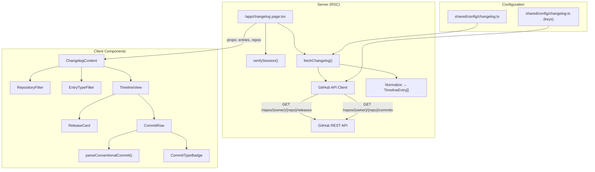
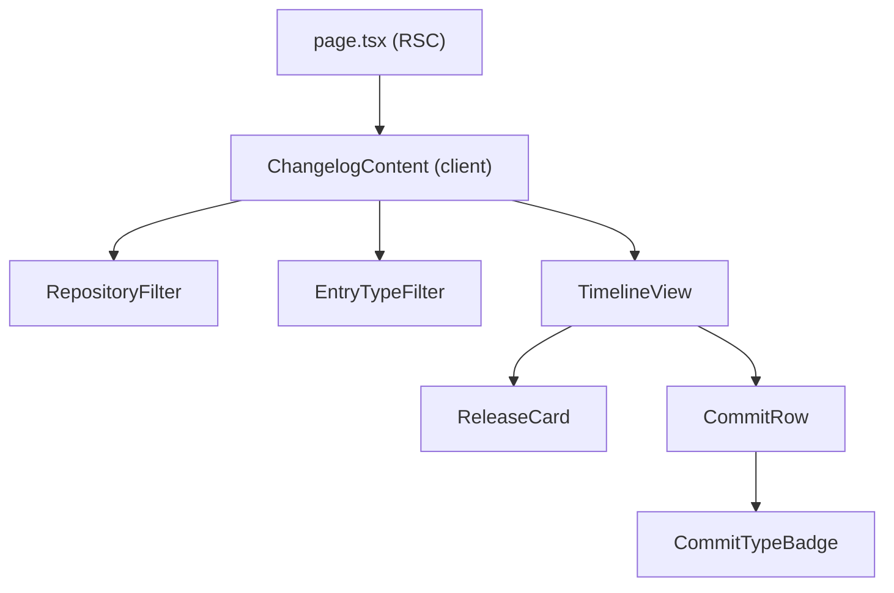

# Design Document: Unified Changelog

## Overview

The Unified Changelog feature aggregates GitHub release and commit data from configured ATL organization repositories into a single chronological timeline within the Portal dashboard. It follows the established patterns in the codebase: server-side data fetching via RSC (like the Feed page), client-side filtering (like `FeedContent`), and the existing feature module structure.

The feature introduces:
- A static repository configuration file (mirroring `shared/config/feed.ts`)
- A server-side changelog service that fetches from the GitHub REST API using `fetch` with Next.js caching
- A client-side conventional commit parser
- A timeline UI with filtering and pagination
- A new route at `/app/changelog` protected by `verifySession()`

### Key Design Decisions

1. **Server-side fetching with Next.js `fetch` caching** — Matches the Feed page pattern. GitHub API responses are cached with `next: { revalidate }` to avoid rate limits and reduce latency. No database storage needed.
2. **No dedicated API route** — Data is fetched in the RSC page component and passed to client components, identical to the Feed page pattern. This avoids unnecessary API route boilerplate.
3. **Client-side filtering and pagination** — All timeline entries are fetched server-side and passed to the client. Filtering (by repo, entry type) and pagination happen client-side via `useMemo` and state, matching the `FeedContent` pattern.
4. **Client-side conventional commit parsing** — The parser is a pure function that runs on already-fetched commit messages. No server-side parsing needed.
5. **Optional GitHub token** — The GitHub REST API allows unauthenticated requests (60/hour) but authenticated requests get 5,000/hour. The token is optional via the existing `keys()` env pattern.

## Architecture



### Data Flow

1. User navigates to `/app/changelog`
2. `verifySession()` ensures authentication (redirects to sign-in if not)
3. `fetchChangelog()` reads `CHANGELOG_REPOS` config, fetches releases and commits in parallel from all repos using `Promise.allSettled`
4. Responses are normalized into `TimelineEntry[]` (discriminated union of `ReleaseEntry | CommitEntry`), sorted by date descending
5. Entries and repo metadata are passed as props to `ChangelogContent` (client component)
6. Client-side: user filters by repo, entry type; pagination via "Load more" button
7. Conventional commit parsing happens at render time in `CommitRow`

## Components and Interfaces

### File Structure

```
apps/portal/src/
├── app/(dashboard)/app/changelog/
│   ├── page.tsx                    # RSC page — fetches data, renders layout
│   └── changelog-content.tsx       # Client component — filters, timeline, pagination
├── features/changelog/
│   ├── lib/
│   │   ├── service.ts              # fetchChangelog(), fetchRepoReleases(), fetchRepoCommits()
│   │   ├── parser.ts               # parseConventionalCommit()
│   │   └── types.ts                # TimelineEntry, ReleaseEntry, CommitEntry, etc.
│   └── components/
│       ├── timeline-view.tsx        # Timeline list with load-more pagination
│       ├── release-card.tsx         # Highlighted release entry
│       ├── commit-row.tsx           # Compact commit entry with badge
│       ├── commit-type-badge.tsx    # Colored pill for conventional commit type
│       ├── repository-filter.tsx    # Multi-select repo filter
│       └── entry-type-filter.tsx    # Tabs/segmented control for all/releases/commits
├── shared/config/
│   └── changelog.ts                # CHANGELOG_REPOS config, revalidation interval, env keys
```

### Component Hierarchy



### Service Layer

```typescript
// features/changelog/lib/service.ts

/** Fetch all changelog data from configured repos */
async function fetchChangelog(repos: RepoConfig[]): Promise<ChangelogResult>

/** Fetch releases for a single repo */
async function fetchRepoReleases(repo: RepoConfig): Promise<RepoFetchResult<ReleaseEntry>>

/** Fetch commits for a single repo */
async function fetchRepoCommits(repo: RepoConfig): Promise<RepoFetchResult<CommitEntry>>
```

`fetchChangelog` uses `Promise.allSettled` to fetch all repos in parallel. Each individual fetch uses `fetch()` with `next: { revalidate: CHANGELOG_REVALIDATE_SECONDS }` for ISR caching, matching the Feed page pattern. Failed repos are excluded from results with errors logged.

### Conventional Commit Parser

```typescript
// features/changelog/lib/parser.ts

interface ParsedCommitMessage {
  type: ConventionalCommitType | null;
  scope: string | null;
  description: string;
  breaking: boolean;
}

function parseConventionalCommit(message: string): ParsedCommitMessage
```

The parser uses a single regex matching `type(scope)!: description` against the first line of the commit message. If the extracted type is in the recognized set, it returns the parsed result. Otherwise, `type` is `null` and `description` is the full first line.

### Filter Components

- `RepositoryFilter`: Multi-select toggle list of repos (mirrors `FilterPanel` in feed). Shows entry count per repo. When none selected, all repos shown.
- `EntryTypeFilter`: Segmented control with three options: All, Releases, Commits. Uses shadcn `ToggleGroup` or similar.

Both filters update client-side state. `ChangelogContent` computes `filteredEntries` via `useMemo`, identical to the `FeedContent` pattern.

### Pagination

Client-side "load more" pagination. All entries are available in memory (they're passed from RSC). A `visibleCount` state starts at `PAGE_SIZE` (e.g., 30) and increments on "Load more" click. `TimelineView` renders `entries.slice(0, visibleCount)`.

## Data Models

### Configuration

```typescript
// shared/config/changelog.ts

interface RepoConfig {
  owner: string;
  repo: string;
  displayName: string;
}

const CHANGELOG_REPOS: RepoConfig[] = [
  { owner: "allthingslinux", repo: "portal", displayName: "Portal" },
  { owner: "allthingslinux", repo: "tux", displayName: "Tux Bot" },
  // ... more repos
];

const CHANGELOG_REVALIDATE_SECONDS = 600; // 10 minutes
const CHANGELOG_MAX_COMMITS_PER_REPO = 30;
const CHANGELOG_PAGE_SIZE = 30;
```

### Timeline Entry Types

```typescript
// features/changelog/lib/types.ts

type ConventionalCommitType =
  | "feat" | "fix" | "refactor" | "chore" | "docs"
  | "style" | "perf" | "test" | "build" | "ci";

interface ReleaseEntry {
  type: "release";
  id: string;
  repoId: string;           // "owner/repo"
  repoDisplayName: string;
  tagName: string;
  title: string;
  body: string;              // markdown
  date: string;              // ISO 8601
  url: string;               // GitHub release URL
}

interface CommitEntry {
  type: "commit";
  id: string;
  repoId: string;
  repoDisplayName: string;
  sha: string;               // full SHA
  shortSha: string;          // 7-char abbreviated
  message: string;           // full commit message
  authorName: string;
  authorAvatarUrl: string;
  date: string;              // ISO 8601
  url: string;               // GitHub commit URL
}

type TimelineEntry = ReleaseEntry | CommitEntry;

interface RepoFetchResult<T> {
  repoId: string;
  repoDisplayName: string;
  entries: T[];
  error?: string;
}

interface ChangelogResult {
  entries: TimelineEntry[];   // sorted by date desc
  repos: RepoSummary[];      // for filter UI
  errors: RepoError[];       // failed repos
}

interface RepoSummary {
  repoId: string;
  displayName: string;
  entryCount: number;
}

interface RepoError {
  repoId: string;
  displayName: string;
  error: string;
}
```

### Conventional Commit Badge Colors

```typescript
const COMMIT_TYPE_COLORS: Record<ConventionalCommitType, string> = {
  feat:     "bg-green-100 text-green-800 dark:bg-green-900/30 dark:text-green-400",
  fix:      "bg-red-100 text-red-800 dark:bg-red-900/30 dark:text-red-400",
  refactor: "bg-blue-100 text-blue-800 dark:bg-blue-900/30 dark:text-blue-400",
  chore:    "bg-gray-100 text-gray-800 dark:bg-gray-900/30 dark:text-gray-400",
  docs:     "bg-purple-100 text-purple-800 dark:bg-purple-900/30 dark:text-purple-400",
  style:    "bg-pink-100 text-pink-800 dark:bg-pink-900/30 dark:text-pink-400",
  perf:     "bg-orange-100 text-orange-800 dark:bg-orange-900/30 dark:text-orange-400",
  test:     "bg-yellow-100 text-yellow-800 dark:bg-yellow-900/30 dark:text-yellow-400",
  build:    "bg-indigo-100 text-indigo-800 dark:bg-indigo-900/30 dark:text-indigo-400",
  ci:       "bg-teal-100 text-teal-800 dark:bg-teal-900/30 dark:text-teal-400",
};
```

## Correctness Properties

*A property is a characteristic or behavior that should hold true across all valid executions of a system — essentially, a formal statement about what the system should do. Properties serve as the bridge between human-readable specifications and machine-verifiable correctness guarantees.*

### Property 1: Failed repos are excluded, successful repos are included

*For any* set of repository configurations and any subset of those repos that fail (HTTP error, network timeout, or unreachable), the `ChangelogResult` should contain entries only from the repos that succeeded, and the `errors` array should contain exactly the repos that failed.

**Validates: Requirements 1.3, 9.1, 9.2**

### Property 2: Normalization produces complete entries

*For any* valid GitHub release API response object, normalizing it into a `ReleaseEntry` should produce an object containing all required fields (type, id, repoId, repoDisplayName, tagName, title, body, date, url). *For any* valid GitHub commit API response object, normalizing it into a `CommitEntry` should produce an object containing all required fields (type, id, repoId, repoDisplayName, sha, shortSha, message, authorName, authorAvatarUrl, date, url), and `shortSha` should be exactly 7 characters long and equal to the first 7 characters of `sha`.

**Validates: Requirements 2.3, 3.3**

### Property 3: Commit count is capped per repository

*For any* repository configuration with a max commits setting `N`, and any GitHub API response returning `M` commits, the number of `CommitEntry` items produced for that repo should be `min(M, N)`.

**Validates: Requirements 3.6**

### Property 4: Timeline entries are sorted by date descending

*For any* list of `TimelineEntry` items returned by `fetchChangelog`, for every consecutive pair of entries `(entries[i], entries[i+1])`, the date of `entries[i]` should be greater than or equal to the date of `entries[i+1]`.

**Validates: Requirements 4.1**

### Property 5: Conventional commit parser correctness

*For any* string, `parseConventionalCommit` should satisfy: if the string matches the conventional commit pattern with a recognized type (`feat`, `fix`, `refactor`, `chore`, `docs`, `style`, `perf`, `test`, `build`, `ci`), then the result should have `type` equal to the matched type, `scope` equal to the matched scope (or `null` if no scope), and `description` equal to the remaining text. If the string does not match any recognized pattern, `type` should be `null`, `scope` should be `null`, and `description` should be the full first line of the input.

**Validates: Requirements 5.1, 5.2, 5.5, 5.6**

### Property 6: Each conventional commit type has a unique color

*For any* two distinct `ConventionalCommitType` values, their corresponding entries in `COMMIT_TYPE_COLORS` should be different strings.

**Validates: Requirements 5.4**

### Property 7: Conventional commit parse-format round trip

*For any* valid conventional commit message (matching the conventional commit pattern with a recognized type), parsing the message and then formatting the parsed result back into a string and parsing again should produce the same `type` and `scope` values.

**Validates: Requirements 5.7**

### Property 8: Combined filtering returns the intersection of repo and type filters

*For any* list of `TimelineEntry` items, any set of selected repository IDs (possibly empty), and any entry type filter (`"all"`, `"releases"`, `"commits"`): the filtered result should contain exactly those entries where (A) the entry's `repoId` is in the selected set (or the selected set is empty, meaning all repos) AND (B) the entry's `type` matches the type filter (or the type filter is `"all"`). No entries outside this intersection should appear, and no entries inside it should be missing.

**Validates: Requirements 6.2, 6.3, 7.2, 7.3, 7.4, 7.5**

### Property 9: Repository entry counts are accurate

*For any* list of `TimelineEntry` items, the `RepoSummary.entryCount` for each repository should equal the number of entries in the list whose `repoId` matches that repository.

**Validates: Requirements 6.4**

### Property 10: Pagination displays correct number of entries

*For any* list of `TimelineEntry` items with length `T` and any page size `P`, the initially visible entries should be `min(T, P)`. After `K` "load more" actions, the visible entries should be `min(T, P * (K + 1))`.

**Validates: Requirements 8.1, 8.2**

## Error Handling

### GitHub API Errors

| Error Condition | Handling Strategy |
|---|---|
| Non-success HTTP response (4xx/5xx) | Log error with repo identifier and status code. Exclude repo from results. Add to `ChangelogResult.errors`. |
| Network timeout | Same as above. Use `AbortSignal.timeout()` on fetch calls with a configurable timeout (e.g., 10s). |
| All repos fail | `ChangelogResult.entries` is empty, `errors` is non-empty. UI renders an error state message. |
| Rate limit (403/429) | Next.js `fetch` caching serves stale data automatically when `next: { revalidate }` is used. The cached response is served until revalidation succeeds. No custom cache logic needed. |
| Malformed JSON response | Caught by `response.json()` rejection. Treated as a fetch failure — repo excluded, error logged. |

### Service Implementation

```typescript
async function fetchRepoReleases(repo: RepoConfig): Promise<RepoFetchResult<ReleaseEntry>> {
  try {
    const response = await fetch(
      `https://api.github.com/repos/${repo.owner}/${repo.repo}/releases`,
      {
        headers: buildGitHubHeaders(),
        next: { revalidate: CHANGELOG_REVALIDATE_SECONDS },
        signal: AbortSignal.timeout(10_000),
      }
    );

    if (!response.ok) {
      return {
        repoId: `${repo.owner}/${repo.repo}`,
        repoDisplayName: repo.displayName,
        entries: [],
        error: `HTTP ${response.status}`,
      };
    }

    const data = await response.json();
    return {
      repoId: `${repo.owner}/${repo.repo}`,
      repoDisplayName: repo.displayName,
      entries: normalizeReleases(data, repo),
    };
  } catch (err) {
    return {
      repoId: `${repo.owner}/${repo.repo}`,
      repoDisplayName: repo.displayName,
      entries: [],
      error: err instanceof Error ? err.message : "Unknown error",
    };
  }
}
```

### UI Error States

- **Partial failure**: Timeline renders entries from successful repos. No visible error indicator (failed repos are silently excluded, matching the Feed page pattern).
- **Total failure**: Full-page empty state with a message like "Changelog data is temporarily unavailable. Please try again later."
- **No entries (success but empty)**: Empty state with "No activity found across configured repositories."

### GitHub Token

The optional `GITHUB_TOKEN` env var is managed via the `keys()` pattern:

```typescript
// shared/config/changelog.ts
import { createEnv } from "@t3-oss/env-nextjs";
import { z } from "zod";
import "server-only";

export const keys = () =>
  createEnv({
    server: {
      GITHUB_TOKEN: z.string().min(1).optional(),
    },
    client: {},
    runtimeEnv: {
      GITHUB_TOKEN: process.env.GITHUB_TOKEN,
    },
  });
```

The token is added to request headers when present:

```typescript
function buildGitHubHeaders(): HeadersInit {
  const headers: HeadersInit = {
    Accept: "application/vnd.github.v3+json",
    "User-Agent": "Portal/1.0 (https://portal.atl.tools)",
  };
  const token = process.env.GITHUB_TOKEN;
  if (token) {
    headers.Authorization = `Bearer ${token}`;
  }
  return headers;
}
```

## Testing Strategy

### Testing Framework

- **Unit/Integration tests**: Vitest (already configured at `apps/portal/vitest.config.ts`)
- **Property-based tests**: `fast-check` v4 (already a devDependency)
- **Test location**: `apps/portal/tests/features/changelog/`

### Property-Based Tests

Property-based tests verify universal properties across randomly generated inputs. Each property test must:
- Run a minimum of 100 iterations
- Reference its design document property via a tag comment
- Use `fast-check` arbitraries to generate random inputs
- Each correctness property is implemented by a single property-based test

**Property tests to implement:**

| Test File | Properties Covered |
|---|---|
| `service.property.test.ts` | Property 1 (resilience), Property 2 (normalization), Property 3 (commit capping), Property 4 (sort order) |
| `parser.property.test.ts` | Property 5 (parser correctness), Property 6 (color uniqueness), Property 7 (round trip) |
| `filter.property.test.ts` | Property 8 (combined filtering), Property 9 (repo counts), Property 10 (pagination) |

**Tag format**: `Feature: unified-changelog, Property {N}: {title}`

Example:
```typescript
// Feature: unified-changelog, Property 5: Conventional commit parser correctness
it("should correctly parse any conventional commit message", () => {
  fc.assert(
    fc.property(
      conventionalCommitArbitrary(),
      (message) => {
        const result = parseConventionalCommit(message);
        // ... assertions
      }
    ),
    { numRuns: 100 }
  );
});
```

### Unit Tests

Unit tests complement property tests by covering specific examples, edge cases, and integration points:

| Test File | Coverage |
|---|---|
| `service.test.ts` | Specific GitHub API response shapes, empty response handling, all-repos-fail scenario (Req 9.3), rate-limit header handling |
| `parser.test.ts` | Known conventional commit examples (`feat: add login`, `fix(auth): resolve token issue`), non-matching messages, empty strings, multi-line messages, breaking change indicator (`feat!: ...`) |
| `filter.test.ts` | Empty entry list filtering, single repo selection, empty state display trigger (Req 4.6) |

### Test Generators (fast-check Arbitraries)

Key arbitraries needed for property tests:

```typescript
// Arbitrary for a valid GitHub release API response
const githubReleaseArb = fc.record({
  id: fc.nat(),
  tag_name: fc.stringMatching(/^v\d+\.\d+\.\d+$/),
  name: fc.string({ minLength: 1 }),
  body: fc.string(),
  published_at: fc.date().map(d => d.toISOString()),
  html_url: fc.constant("https://github.com/org/repo/releases/tag/v1.0.0"),
});

// Arbitrary for a valid GitHub commit API response
const githubCommitArb = fc.record({
  sha: fc.hexaString({ minLength: 40, maxLength: 40 }),
  commit: fc.record({
    message: fc.string({ minLength: 1 }),
    author: fc.record({
      name: fc.string({ minLength: 1 }),
      date: fc.date().map(d => d.toISOString()),
    }),
  }),
  author: fc.record({
    avatar_url: fc.constant("https://avatars.githubusercontent.com/u/1"),
  }),
  html_url: fc.constant("https://github.com/org/repo/commit/abc1234"),
});

// Arbitrary for a conventional commit message
const conventionalCommitArb = fc.tuple(
  fc.constantFrom("feat", "fix", "refactor", "chore", "docs", "style", "perf", "test", "build", "ci"),
  fc.option(fc.stringOf(fc.char().filter(c => c !== ')'), { minLength: 1 }), { nil: undefined }),
  fc.string({ minLength: 1 }).filter(s => !s.startsWith(' ')),
).map(([type, scope, desc]) =>
  scope ? `${type}(${scope}): ${desc}` : `${type}: ${desc}`
);

// Arbitrary for a TimelineEntry
const timelineEntryArb = fc.oneof(
  releaseEntryArb,  // derived from githubReleaseArb + normalization
  commitEntryArb,   // derived from githubCommitArb + normalization
);
```
